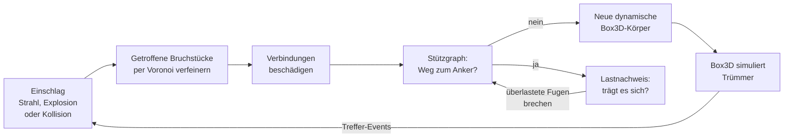

# Nebenan

**Polygonale Echtzeit-Zerstörung für [Box3D](https://github.com/erincatto/box3d).**
Wände brechen in echte konvexe Polygon-Bruchstücke, nicht in Voxel. Jedes Bruchstück ist eine
Box3D-Hülle, jedes lose Trümmerteil ein Box3D-Starrkörper, und Gebäude halten über einen Stützgraphen
zusammen, bis man ihnen die Stützen wegschießt.

- Geschrieben in C17 nach dem Vorbild von Box3D: datenorientiert, Pools mit Generations-IDs, Arena für
  temporäre Daten, keine Abhängigkeiten außer Box3D
- Voronoi-Bruch, der sich auf den Einschlag konzentriert: kleine Splitter am Einschlagpunkt, große Platten
  weiter weg
- Nur die getroffenen Bruchstücke werden verfeinert, der Rest der Wand bleibt ein großes Stück
- Voronoi-Zellen und Hüllen werden auf mehrere Threads verteilt, über das eigene Task-System oder eingebaute
  Threads. Das Ergebnis hängt nicht von der Zahl der Threads ab
- Lastnachweis: Jedes Bauwerk muss sein Eigengewicht tragen. Ein elastisches Modell aller Verbindungen, exakt
  gelöst, findet die überlasteten Fugen. Kragarme brechen an der Einspannung, Balken ohne Stütze über die
  Spannweite, Dächer ohne Säulen stürzen ein
- Mehrere Materialien in einem Bauwerk, zum Beispiel Ziegelwände mit Betondecken. Jedes Bruchstück behält
  das Material seines Teils, eine Fuge zwischen zwei Materialien hält so viel wie das schwächere
- Kollisionsschaden: Kanonenkugeln und herabfallende Trümmer beschädigen, was sie treffen
- Staub-Ereignisse für Partikeleffekte: am Einschlag, an jedem Riss und wenn Trümmer hart aufschlagen
- Deterministisch: gleiche Eingaben ergeben bitgleich das gleiche Bruchmuster, unter Windows, Linux und macOS,
  auf x64 und ARM
- PC-Demo für Windows (Direct3D 11), macOS (Metal) und Linux (OpenGL)

## Demo herunterladen

Jeder Push baut die Demo automatisch mit GitHub Actions.

1. Im Repository oben auf **Actions** klicken, links den Workflow **Build** wählen und den neuesten grünen
   Lauf öffnen.
2. Unten unter **Artifacts** `nebenan-demo-windows` herunterladen (dafür muss man bei GitHub angemeldet
   sein). Für Mac und Linux gibt es `nebenan-demo-macos` und `nebenan-demo-linux`.
3. ZIP entpacken und `nebenan_demo.exe` starten.

Die EXE ist nicht signiert. Wenn Windows SmartScreen warnt: **Weitere Informationen**, dann
**Trotzdem ausführen**. Sie braucht keine Installation und kein Visual-C++-Redistributable.
GitHub löscht Artefakte nach 90 Tagen. Mit **Run workflow** auf der Workflow-Seite entsteht ein neuer Build.

Unter Linux und macOS gehen beim Entpacken die Ausführungsrechte verloren: `chmod +x nebenan_demo`.
Auf dem Mac zusätzlich `xattr -d com.apple.quarantine nebenan_demo` oder im Finder Rechtsklick,
**Öffnen**. Der Mac-Build läuft auf Apple Silicon.

## Selbst bauen

Voraussetzungen: CMake 3.22 oder neuer, Git, ein C17/C++17-Compiler und eine Internetverbindung beim
ersten Konfigurieren. CMake lädt Box3D (auf einen festen Commit gepinnt) und Dear ImGui selbst herunter.

**Windows** mit Visual Studio 2022 oder neuer (Workload „Desktopentwicklung mit C++"):

```bat
git clone https://github.com/holz231/nebenan.git
cd nebenan
build.bat
build\bin\Release\nebenan_demo.exe
```

`build.bat` in der „Developer Command Prompt" von Visual Studio ausführen, dort ist CMake schon im Pfad.
Danach liegt die Projektmappe `nebenan` im Ordner `build`. In Visual Studio öffnen, `Release` wählen, F5
startet die Demo.

**Linux** (Ubuntu/Debian):

```sh
sudo apt install build-essential cmake git libgl-dev libx11-dev libxi-dev libxcursor-dev
./build.sh
build/bin/nebenan_demo
```

**macOS** mit den Xcode Command Line Tools und CMake (`brew install cmake`):

```sh
./build.sh
build/bin/nebenan_demo
```

CMake-Optionen: `NEBENAN_DEMO`, `NEBENAN_TESTS`, `NEBENAN_BENCHMARK` (bei eigenständigem Bau alle an) und
`NEBENAN_WARNINGS_AS_ERRORS`. Mit `-DFETCHCONTENT_SOURCE_DIR_BOX3D=/pfad/zu/box3d` wird eine lokale
Box3D-Kopie verwendet.

## Steuerung

| Eingabe | Aktion |
| --- | --- |
| Linke Maustaste | schießen, gedrückt halten für Dauerfeuer |
| Rechte Maustaste halten | umsehen |
| W A S D | bewegen |
| Q / E | runter / hoch |
| Shift | schneller bewegen |
| Mausrad | vor und zurück |
| 1 / 2 / 3 | Gewehr / Granate / Kanone |
| R | Szene neu laden |
| P | Pause |
| T | Zeitlupe |
| C | lose Trümmer entfernen |
| F | Bruchstücke einzeln einfärben |
| L | Statik: jedes Bruchstück nach der Auslastung seiner Fugen einfärben, grün bis rot |
| F1 | Menü ein- und ausblenden |

Das Menü zeigt die Zeiten von Physik, Zerstörung und letztem Einschlag und wie viele Verbindungen der
Lastnachweis gebrochen hat. Die Statik-Ansicht (L) zeigt, wie die Last durch das Bauwerk läuft: grün entspannt,
gelb halb ausgelastet, rot kurz vor dem Bruch, lose Trümmer grau. Es erlaubt Waffenwerte, Zeitlupe und die Zahl der Threads für Physik und
Zerstörung zu ändern und schaltet Staub und Splitter ein und aus.

**Werkzeuge**

- **Gewehr**: kleiner Krater mit Radius 0,35 m. Splitter platzen an der Oberfläche heraus, Ziegel zerbröseln
  bei Dauerfeuer bis zum Loch.
- **Granate**: Explosion mit Radius 1,3 m, reißt große Löcher und schleudert Bruchstücke radial weg.
- **Kanone**: eine echte Box3D-Kugel mit 45 m/s. Der Schaden entsteht allein aus der Aufprallenergie, die
  Kugel schlägt durch und nimmt Trümmer mit.

**Szenen**

- **Mauern**: Ziegelwände vor einer dicken Betonwand
- **Haus**: zweistöckiges Haus aus Ziegelwänden mit Fenstern, Tür und Betondecken. Im Skript sprengen elf
  Granaten Vorder-, Rück- und rechte Wand des Erdgeschosses. Das Obergeschoss hängt dann an den Resten der
  linken Wand, reißt ab und sackt als Ganzes auf die Mauerstümpfe.
- **Säulenhalle**: Betonsäulen tragen Balken und Dach, alles vorab in Zellen von 1,2 m zerlegt. Die vorderen
  Säulen wegschießen: Balken und Dach brechen über die Spannweite und stürzen ein.
- **Turm**: hohler Ziegelturm aus verzahnten Ringen, 12 m hoch
- **Stresstest**: 16 Wände für viele Trümmer gleichzeitig

Aufrufoptionen: `--scene 0..4` startet eine Szene, `--script` feuert eine vorgegebene Schussfolge ab,
`--frames N` beendet nach N Bildern und `--screenshot datei.ppm` speichert dann ein Bild, `--load-view`
schaltet die Statik-Ansicht ein.

## So funktioniert es



**Konvexe Polyeder statt Voxel.** Jedes Bruchstück ist ein konvexes Polyeder aus Ecken und Flächen mit
Ebenen. Schneidet man es mit einer Ebene, entstehen zwei konvexe Polyeder mit exaktem Volumen. Die
Schnittflächen bekommen das Innenmaterial (zum Beispiel Ziegelbruch oder Beton), die Außenflächen behalten
ihr Material. Die gleichen Polygone dienen als Kollisionsform und als Render-Mesh.

**Voronoi-Bruch mit Fokus.** Die Bruchpunkte werden um den Einschlag herum verteilt, mit einer Dichte, die
mit der Entfernung abnimmt. Dadurch entstehen am Einschlag Splitter in der Größe `fragmentSize` und weiter
außen große Platten. Ein Hash-Gitter hält die Punkte auf Abstand. Jede Voronoi-Zelle entsteht durch
Schneiden des Bruchstücks an den Mittelebenen zu den nächsten Nachbarpunkten, sortiert nach Abstand. Sobald
der nächste Punkt weiter als der doppelte Zellradius entfernt ist, kann keine weitere Ebene die Zelle mehr
schneiden, und die Suche endet. Die Zahl der Splitter richtet sich nach dem beschädigten Volumen und ist pro
Einschlag begrenzt.

**Hierarchische Verfeinerung.** Nur Bruchstücke, die die Schadenskugel berühren, werden zerteilt, und jedes
nur bis zur Tiefe `maxDepth`. Eine Wand mit einem Einschussloch besteht danach aus ein paar Dutzend Stücken
statt aus Tausenden.

**Mehrere Threads.** Ein Einschlag läuft in drei Phasen. Zuerst werden die Bruchpunkte aller getroffenen
Stücke in fester Reihenfolge gezogen. Dann berechnen die Worker die Voronoi-Zellen samt Box3D-Hüllen. Jede
Zelle hängt nur von ihren Eingaben ab, die Worker holen sich die nächste Zelle über einen atomaren Zähler und
schreiben in eine eigene Arena. Zuletzt werden Stücke und Verbindungen wieder in fester Reihenfolge
eingebaut. Deshalb ist das Ergebnis mit einem, vier oder acht Threads bitgleich. Wie Box3D nimmt Nebenan das
Task-System der Anwendung (`enqueueTask` und `finishTask` mit denselben Signaturen wie in Box3D) oder
startet eigene Threads. Die Vorzerlegung beim Laden läuft genauso.

**Stützgraph.** Zwei Bruchstücke sind verbunden, wenn sich ihre Flächen berühren. Jede Verbindung hält
`strength × Kontaktfläche` aus, zwischen zwei Materialien mit dem kleineren `strength`. Der Schaden eines
Einschlags fällt zum Rand hin ab. Reißen Verbindungen, sucht Nebenan ab der beschädigten Stelle nach dem
kürzesten Weg zu einem verankerten Stück (Best-First-Suche, dadurch nur lokale Arbeit). Teile ohne Weg zum
Anker werden zu dynamischen Körpern.

**Lastnachweis.** Hängt ein Teil noch am Anker, muss es auch sein Gewicht tragen können. Nach jeder
Änderung rechnet Nebenan das statische Bauwerk durch: Jedes Bruchstück ist ein starrer Körper, jede
Verbindung eine elastische Fuge, die sich gegen Öffnen, Schließen und Gleiten proportional zu ihrer Fläche
wehrt und gegen Biegen und Verdrehen proportional zum Flächenträgheitsmoment ihrer Kontaktfläche. Unter dem
Eigengewicht verschiebt und verdreht sich jedes nicht verankerte Stück ein wenig. Das ist ein dünnbesetztes
lineares Gleichungssystem mit sechs Unbekannten pro Stück, und Nebenan löst es exakt: Cholesky-Zerlegung in
6×6-Blöcken, in Minimum-Degree-Reihenfolge, damit wenig Auffüllung entsteht, alles in doppelter Genauigkeit
und in fester Reihenfolge, also deterministisch. Die Last verteilt sich wie im echten Bauwerk nach
Steifigkeit: Breite Fugen tragen mehr als schmale, ein Balken liegt auf beiden Stützen auf, eine Wand trägt
um ein Loch herum. Aus Kraft und Moment jeder Fuge folgen Normalspannung plus Biegerandspannung sowie Schub
plus Torsion. Das Verhältnis zur Festigkeit ist die Auslastung: Was über `tensileStrength` (Zug, Biegezug,
Schub, bei Druck mit Reibung) oder `compressiveStrength` (Druck) liegt, bricht, eine Fuge zwischen zwei
Materialien mit den Werten des schwächeren. Wie im echten Bauwerk versagen die am stärksten überlasteten
Fugen zuerst: Es brechen die mit mindestens 80 % der höchsten Auslastung, und in jedem Fall alle, die das
Vierfache ihrer Festigkeit tragen, denn nur knapp überlastete Fugen kann eine Umlagerung noch retten.
Danach verteilt sich die Last neu, und der Nachweis läuft im nächsten Update wieder, bis der Rest hält. So
reißt ein Kragarm an einem Querschnitt ab statt an jedem, und ein Einsturz schreitet Update für Update
fort. `nbChunk_GetUtilization` liefert pro Bruchstück die höchste Auslastung des letzten Nachweises, die
Demo färbt damit die Statik ein. Weil die Bruchstücke starr sind, biegt sich ein einzelnes langes Stück
nicht. Lange Balken und Decken sollten deshalb mit `cellSize` vorab in Zellen zerlegt werden, dann brechen
sie über die Spannweite.

Zerschossene Bereiche bestehen aus Hunderten Splittern, die unter ihrem eigenen Gewicht nie versagen (die
Spannung ist etwa Dichte × g × Größe, wenige kPa). Deshalb fasst der Nachweis verbundene Stücke, die in derselben
Zelle eines Rasters von vier Splittergrößen liegen, zu einem starren Cluster zusammen. Hat ein Bauwerk mehr als
320 Cluster, wird das Raster vergröbert. So kostet ein Nachweis auch für eine völlig zerschossene Wand mit
2500 Bruchstücken höchstens ein paar Millisekunden, meist deutlich unter einer. Die einfache Regel `maxSpan`
(maximale Auskragung) gibt es weiterhin, sie ist aber standardmäßig aus.

**Box3D-Anbindung.** Jedes statische Bruchstück hat einen eigenen statischen Körper, denn das Entfernen
einer Form in Box3D kostet so viel wie der Körper Kontakte hat. Jede lose Insel ist ein dynamischer
Verbundkörper mit einer Hülle pro Bruchstück. Die Hüllen baut Nebenan direkt aus der bekannten Topologie
des Polyeders, 4- bis 6-mal schneller als Quickhull (`b3CreateHull` bleibt der Fallback). Treffer-Events von
Box3D werden zu Kollisionsschaden: Energie aus reduzierter Masse und Aufprallgeschwindigkeit, Radius aus
der Kubikwurzel der Energie. Weil Box3D den Kontakt schon aufgelöst hat, bevor die Wand bricht, bekommt ein
durchschlagendes Geschoss einen Teil seiner Geschwindigkeit zurück (`collisionPassThrough`).

**Trümmerverwaltung.** Die Zahl der losen Trümmerkörper ist begrenzt, zuerst verschwinden die ältesten
kleinen Stücke. Optional haben kleine Trümmer eine Lebensdauer. Was unter `killDepth` fällt, wird über die
Bewegungs-Events von Box3D gefunden, ohne alle Körper abzusuchen. Splitter unter `minFragmentVolume` werden
zu Staub und gar nicht erst erzeugt.

**Determinismus.** Zufallszahlen aus PCG32 mit festem Seed, jede Zufallszahl in einer eigenen Anweisung
(C legt die Reihenfolge innerhalb einer Argumentliste nicht fest, und Compiler machen es verschieden), eigene
Kubikwurzel, keine FMA-Kontraktion und sortierte Abfrageergebnisse. Zusammen mit dem deterministischen Box3D
ergeben die gleichen Einschläge bitgleich die gleichen Bruchstücke, egal ob mit MSVC, GCC oder Clang gebaut,
auf x64 oder ARM, mit einem oder mehreren Threads. Die CI prüft das auf allen Plattformen gegen denselben
Hash. Das ist die Grundlage für Replays und Lockstep-Netzwerkspiel.

**Staub.** Wo Material zerbröselt, meldet Nebenan ein Staub-Ereignis mit Ort, Geschwindigkeit, Ausbreitung,
Menge und Material: am Einschlag (ein Zehntel des beschädigten Volumens plus die Splitter unter
`minFragmentVolume`), an jeder gerissenen Verbindung und wenn Trümmer hart aufschlagen. Die Simulation hängt
davon nicht ab, der Renderer macht daraus Partikel. Die Demo zeichnet Staubwolken und kleine Splitter als
Billboards in einem einzigen Draw Call.

**Speicher.** Pools mit Freilisten und IDs mit Generationszähler wie in Box3D, sodass veraltete IDs erkannt
werden. Temporäre Daten eines Einschlags kommen aus einer Arena, die danach in einem Schritt zurückgesetzt
wird. Eigene Allokatoren lassen sich mit `nbSetAllocator` einhängen, `nbGetByteCount` zählt den Verbrauch.

**Demo-Renderer.** Alle Meshes liegen in wenigen großen Vertex-Seiten, jeder Vertex verweist auf einen
Transformations-Slot, und alle Transformationen gehen einmal pro Bild in einen Storage-Buffer. Tausende
Trümmer kosten so nur eine Handvoll Draw Calls. Dazu Schattenwurf und prozedurale Materialien für Ziegel,
Putz und Beton.

## Benutzung

```c
#include "nebenan/nebenan.h"

// Box3D-Welt wie gewohnt
b3WorldDef physicsDef = b3DefaultWorldDef();
b3WorldId physics = b3CreateWorld( &physicsDef );

// Zerstörungswelt daneben, Voronoi-Zellen auf 4 Threads
nbWorldDef worldDef = nbDefaultWorldDef();
worldDef.physicsWorld = physics;
worldDef.workerCount = 4;
nbWorldId world = nbCreateWorld( &worldDef );

// Ziegelwand: 6 m breit, 3 m hoch, 30 cm dick, unten am Boden verankert
nbDestructibleDef wallDef = nbDefaultDestructibleDef();
wallDef.position = b3ToPos( (b3Vec3){ 0.0f, 1.5f, 0.0f } );
wallDef.material.density = 1900.0f;
wallDef.material.strength = 6.0e5f;
wallDef.material.fragmentSize = 0.1f;
nbCreateBox( world, &wallDef, (b3Vec3){ 3.0f, 1.5f, 0.15f } );

// Schuss: Strahl von der Kamera, Einschlag am ersten getroffenen Bruchstück
nbImpactDef shot = { 0 };
shot.radius = 0.35f;
shot.damage = 1.2e5f;
shot.ejectSpeed = 9.0f;
nbImpactResult result;
nbWorld_CastImpact( world, b3ToPos( eye ), b3MulSV( 100.0f, aim ), &shot, &result );

// Pro Frame
b3World_Step( physics, 1.0f / 60.0f, 4 );
nbWorld_Update( world, 1.0f / 60.0f );

nbEvents events = nbWorld_GetEvents( world );
for ( int i = 0; i < events.createdCount; ++i )
{
	// Neues Bruchstück: flach schattiertes Dreiecksnetz im lokalen Raum von nbChunk_GetBody()
	int count = nbChunk_GetMeshVertexCount( events.createdChunks[i] );
	nbChunk_BuildMesh( events.createdChunks[i], vertices, count, 1.0f );
}
// events.destroyedChunks: Meshes entfernen
// events.movedChunks: Bruchstück hängt jetzt an einem anderen Körper
for ( int i = 0; i < events.dustCount; ++i )
{
	// Staubwolke an events.dust[i].point, Menge events.dust[i].volume in m³
}
```

Gebäude entstehen aus mehreren konvexen Teilen mit `nbCreateDestructible`. Sich berührende Flächen
verschiedener Teile werden automatisch verbunden, `cellSize` zerlegt die Teile schon beim Laden. Ein Teil
kann mit `material` ein eigenes Material bekommen, sonst gilt das des Objekts:

```c
nbPieceDef slab = nbDefaultPieceDef();
slab.halfExtents = (b3Vec3){ 4.5f, 0.125f, 3.25f };
slab.transform.p = (b3Vec3){ 0.0f, 3.125f, 0.0f };
slab.material = &beton;   // Betondecke im Ziegelhaus, def.material ist der Ziegel
```

Bis zu `NB_MAX_MATERIALS` (8) verschiedene Materialien passen in ein Objekt. `nbChunk_GetMaterial` sagt, aus
welchem Material ein Bruchstück ist, und die Box3D-Formen tragen Dichte, Reibung und `userMaterialId` ihres
Materials. Konkave
Formen wie eine Wand mit Fenster werden als mehrere Quader angegeben (siehe `AddWallWithOpenings` in
[demo/demo.cpp](demo/demo.cpp)). Die komplette API steht in [include/nebenan/nebenan.h](include/nebenan/nebenan.h).

Einbinden in ein eigenes CMake-Projekt:

```cmake
include(FetchContent)
FetchContent_Declare(nebenan
	GIT_REPOSITORY https://github.com/holz231/nebenan.git
	GIT_TAG <commit>
)
FetchContent_MakeAvailable(nebenan)
target_link_libraries(mein_spiel PRIVATE nebenan::nebenan)
```

Gibt es das Ziel `box3d::box3d` schon, verwendet Nebenan dieses Box3D. Demo, Tests und Benchmark werden
beim Einbinden nicht gebaut.

## Parameter

| Material (`nbMaterial`) | Standard | Wirkung |
| --- | --- | --- |
| `density` | 2400 kg/m³ | Dichte. Beton 2400, Ziegel 1900, Holz 600 |
| `strength` | 1·10⁶ | Schaden pro m² Verbindungsfläche bis zum Bruch. Höher ist zäher |
| `fragmentSize` | 0,12 m | Kantenlänge der Splitter am Einschlag |
| `minFragmentVolume` | 2·10⁻⁶ m³ | Kleinere Splitter werden zu Staub |
| `maxDepth` | 6 | Wie oft ein Bruchstück weiter zerteilt werden kann |
| `tensileStrength` | 2·10⁶ Pa | Zug-, Biegezug- und Schubfestigkeit der Fugen im Lastnachweis. Mauerwerk etwa 0,3 MPa, Beton 2 MPa |
| `compressiveStrength` | 3·10⁷ Pa | Druckfestigkeit der Fugen. Mauerwerk etwa 6 MPa, Beton 30 MPa. Beide 0 schaltet den Nachweis ab |
| `maxSpan` | 0 m | Zusätzliche einfache Regel: maximale Auskragung ohne Stütze, 0 schaltet sie ab |
| `friction`, `restitution` | 0,7 / 0,05 | Reibung und Elastizität der Box3D-Formen |

| Welt (`nbWorldDef`) | Standard | Wirkung |
| --- | --- | --- |
| `maxDebrisBodies` | 3000 | Obergrenze für lose Trümmerkörper |
| `debrisLifetime` | 0 s | Lebensdauer kleiner Trümmer, 0 für unbegrenzt |
| `smallDebrisVolume` | 0,002 m³ | Ab dieser Größe gilt ein Trümmer als klein |
| `killDepth` | −100 m | Trümmer darunter werden entfernt |
| `collisionSpeedThreshold` | 4 m/s | Ab dieser Aufprallgeschwindigkeit entsteht Schaden |
| `collisionDamageScale` | 12 | Umrechnung von Aufprallenergie (J) in Schaden |
| `collisionRadiusScale` | 0,035 | Schadensradius pro Kubikwurzel der Energie |
| `maxCollisionImpactsPerUpdate` | 4 | Begrenzt die Kollisionseinschläge pro Frame |
| `maxFragmentsPerImpact` | 160 | Begrenzt die Kosten großer Explosionen |
| `collisionPassThrough` | 0,6 | Anteil der Geschwindigkeit, den ein durchschlagendes Geschoss behält |
| `workerCount` | 1 | Threads für Voronoi-Zellen und Hüllen, der aufrufende Thread zählt mit |
| `enqueueTask`, `finishTask`, `userTaskContext` | leer | Task-System der Anwendung, sonst startet Nebenan eigene Threads |

Die Demo nimmt für Ziegel Dichte 1900, Festigkeit 6·10⁵, Splitter 0,1 m, Zugfestigkeit 0,3 MPa und
Druckfestigkeit 6 MPa, für Beton Dichte 2400, Festigkeit 1,1·10⁶, Splitter 0,13 m, 2 MPa und 30 MPa.

`cellSize` im `nbDestructibleDef` zerlegt alle Teile schon beim Laden in Voronoi-Zellen dieser Größe. Für den
Lastnachweis ist das bei allem nötig, was sich über eine Spannweite biegen soll: Balken, Decken, Dächer.

## Leistung

Gemessen mit `nebenan_benchmark` auf einer Cloud-VM mit 4 Kernen (Intel Xeon, 2,1 GHz), GCC 13, Release.
Ein normaler Spiele-PC ist schneller.

Voronoi-Kern, Platte 4 × 2 × 0,3 m mit Punkten um den Einschlag:

| Zellen | Voronoi | Hüllen direkt | Hüllen mit Quickhull |
| ---: | ---: | ---: | ---: |
| 16 | 0,06 ms | 0,02 ms | 0,08 ms |
| 64 | 0,49 ms | 0,09 ms | 0,48 ms |
| 128 | 1,3 ms | 0,19 ms | 1,1 ms |
| 256 | 3,3 ms | 0,45 ms | 2,7 ms |

Ganze Einschläge (Bruch, Stützgraph, neue Box3D-Körper) und der Box3D-Schritt danach bei 60 Hz mit
4 Substeps, jeweils mit 1 und 4 Threads:

| Szenario | Einschlag Ø, 1 / 4 Threads | Box3D-Schritt Ø, 1 / 4 Threads | Am Ende |
| --- | ---: | ---: | --- |
| Gewehr, 200 Treffer | 0,33 / 0,31 ms | 3,8 / 2,6 ms | 3599 Bruchstücke, 906 Körper |
| 20 Explosionen | 2,7 / 1,9 ms | 11,3 / 5,7 ms | 6727 Bruchstücke, 3225 Körper |
| Gebäudeeinsturz, 18 Treffer | 2,1 / 1,4 ms | 18,3 / 8,5 ms | 4796 Bruchstücke, 2708 Körper |

- Die Voronoi-Zellen einer Explosion brauchen mit 4 Threads 0,5 ms statt 1,4 ms. Der Rest des Einschlags
  (Punktverteilung, Einbau der Stücke, Box3D-Körper und -Formen) läuft auf dem aufrufenden Thread. Bei
  Gewehrtreffern mit ihren wenigen Zellen bringen Threads kaum etwas.
- Ein Gebäude aus 15 Teilen wird beim Laden in 549 Bruchstücke zerlegt: 3,4 ms mit 1 Thread, 2,7 ms mit 4.
  Beim Einsturz sprengen 18 Treffer drei Wände des Erdgeschosses, die Obergeschosse hängen dann an der letzten
  Wand, bis der Lastnachweis sie abbricht.
- `nbWorld_Update` (Kollisionsschaden, Trümmerverwaltung, Lastnachweis) kostet im Mittel 0,2 ms pro Frame.
  Bei der zerschossenen Gewehrwand sind es 1,2 ms, weil nach jedem Treffer eine Wand aus bis zu 2700
  Bruchstücken nachgewiesen wird (etwa 3 ms pro Nachweis). Ein Nachweis für das Gebäude kostet 1,5 bis 2 ms.

Die Physikzeit ist Box3D mit über 3000 Trümmerkörpern. Ein Gewehrtreffer kostet weniger als ein Drittel
Millisekunde. Windows, Linux und macOS kommen im Benchmark auf exakt dieselben Bruchstück- und Körperzahlen,
mit jeder Threadzahl.

## Tests und Benchmark

```sh
build/bin/nebenan_test            # 28 Tests: Geometrie, Voronoi, Stützgraph, Einsturz, Lastnachweis, Materialien, Threads, Staub, Determinismus …
build/bin/nebenan_benchmark 4     # Zahl = Threads für Bruch und Physik
```

Unter Windows liegen die Programme in `build\bin\Release\`. Die CI baut und testet unter Windows, Linux und
macOS und läuft zusätzlich mit AddressSanitizer, UndefinedBehaviorSanitizer und ThreadSanitizer.

## Projektstruktur

```
include/nebenan/    öffentliche API (C17)
src/
  poly.c            konvexe Polyeder: Schneiden, Masse, Kontaktflächen, Meshes
  fracture.c        Voronoi-Bruch und Punktverteilung
  hull_builder.c    Box3D-Hüllen direkt aus der Polyeder-Topologie
  world.c           Welt, Bruchstücke, Verbindungen, Stützgraph, Box3D-Körper, Events
  destructible.c    zerstörbare Objekte und Vorzerlegung
  impact.c          Einschläge und Auswurf der Splitter
  load.c            Lastnachweis: elastisches Fugenmodell und dünnbesetzte Cholesky-Zerlegung
  scheduler.c       eingebaute Threads, wenn die Anwendung kein Task-System mitbringt
test/               Tests
benchmark/          Leistungsmessung
demo/               PC-Demo mit sokol und Dear ImGui
  shaders/          GLSL-Quelle und die mit sokol-shdc erzeugten Shader (HLSL, Metal, GLSL)
.github/workflows/  CI für Windows, Linux und macOS
```

Nach Änderungen an `demo/shaders/scene.glsl` die Shader neu erzeugen, im Ordner `demo/shaders`:
`sokol-shdc --input scene.glsl --output generated/scene.glsl.h --slang hlsl5:metal_macos:glsl430`.

## Grenzen und nächste Schritte

- Nur die Voronoi-Zellen und Hüllen laufen parallel. Punktverteilung, Einbau der Stücke und das Anlegen der
  Box3D-Formen bleiben auf dem aufrufenden Thread, bei großen Explosionen ist das jetzt der größere Teil.
- Der Lastnachweis rechnet Bruchstücke starr und die Fugen linear elastisch: Eine Fuge überträgt auch Zug,
  statt aufzuklaffen, und ein einzelnes langes Stück biegt sich nicht (dafür `cellSize`). Eine vorzerlegte
  Betondecke, die auf Mauerwerk geklebt ist, hebt beim Durchbiegen an den Auflagern ab, und die Ziegelfugen
  reißen schon unter Eigengewicht. Im Demo-Haus bleiben die Decken deshalb ganze Stücke. Fugen innerhalb eines
  Clusters werden nicht geprüft.
- Nur konvexe Teile. Konkave Formen müssen als mehrere konvexe Teile angegeben werden.
- Render- und Physikgeometrie sind dieselben flachen Polygone. Detail-Meshes und Decals fehlen noch, Staub
  gibt es als einfache Partikel in der Demo.
- Box3D ist noch jung (0.x) und kann seine API ändern. Deshalb ist ein fester Commit eingestellt.

## Lizenzen

Nebenan steht unter der MIT-Lizenz (SPDX-Kennung in jeder Quelldatei). Verwendet werden:

- [Box3D](https://github.com/erincatto/box3d) von Erin Catto, MIT-Lizenz
- [sokol](https://github.com/floooh/sokol) von Andre Weissflog, zlib-Lizenz (kommt mit Box3D)
- [Dear ImGui](https://github.com/ocornut/imgui) von Omar Cornut, MIT-Lizenz

Die Lizenztexte liegen dem Demo-Download im Ordner `lizenzen` bei.
