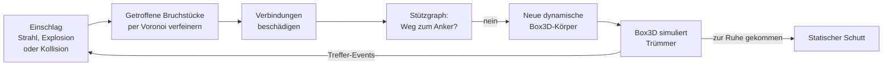

# Nebenan

**Polygonale Echtzeit-Zerstörung für [Box3D](https://github.com/erincatto/box3d), gebaut für Tempo.**
Wände brechen in echte konvexe Polygon-Bruchstücke, nicht in Voxel. Jedes Bruchstück ist eine Box3D-Hülle,
jedes lose Trümmerteil ein Box3D-Starrkörper. Nebenan macht nur das: Wände zerbrechen, Trümmer fallen lassen und
eine ganze Stadt dabei flüssig halten. Keine Statik, kein Staub, keine Schatten. Jede Millisekunde geht in die
Zerstörung.

- Geschrieben in C17 nach dem Vorbild von Box3D: datenorientiert, Pools mit Generations-IDs, Arena für
  temporäre Daten, keine Abhängigkeiten außer Box3D
- Voronoi-Bruch, der sich auf den Einschlag konzentriert: kleine Splitter am Einschlagpunkt, große Platten
  weiter weg. Nur die getroffenen Bruchstücke werden verfeinert, der Rest der Wand bleibt ein großes Stück
- Voronoi-Zellen und Hüllen laufen auf mehreren Threads, über das Task-System der Anwendung oder eingebaute
  Threads. Das Ergebnis hängt nicht von der Zahl der Threads ab
- Stützgraph: Teile ohne Verbindung zum Boden fallen herunter
- Kollisionsschaden: Kanonenkugeln und herabfallende Trümmer beschädigen, was sie treffen
- Für ganze Städte gebaut: Trümmer, die zur Ruhe kommen, werden zu statischem Schutt und kosten Box3D nichts
  mehr. Box3D bewegt nur eine begrenzte Zahl Trümmer gleichzeitig, verdeckte Flächen werden nicht gezeichnet
- Ein Regler für die Bruchstückgröße, der wichtigste Hebel für die Leistung, auch zur Laufzeit
- Deterministisch: gleiche Eingaben ergeben bitgleich das gleiche Bruchmuster, unter Windows, Linux und macOS,
  auf x64 und ARM
- PC-Demo für Windows (Direct3D 11), macOS (Metal) und Linux (OpenGL)

## Demo herunterladen

Jeder Push baut die Demo automatisch mit GitHub Actions.

1. Im Repository oben auf **Actions** klicken, links den Workflow **Build** wählen und den neuesten grünen
   Lauf öffnen.
2. Unten unter **Artifacts** `nebenan-demo-windows` herunterladen (dafür muss man bei GitHub angemeldet
   sein). Für Mac und Linux gibt es `nebenan-demo-macos` und `nebenan-demo-linux`.
3. ZIP entpacken und `nebenan_demo.exe` starten.

Das ist ein Release-Build. Die EXE ist nicht signiert. Wenn Windows SmartScreen warnt: **Weitere
Informationen**, dann **Trotzdem ausführen**. Sie braucht keine Installation und kein
Visual-C++-Redistributable. GitHub löscht Artefakte nach 90 Tagen. Mit **Run workflow** auf der Workflow-Seite
entsteht ein neuer Build.

Unter Linux und macOS gehen beim Entpacken die Ausführungsrechte verloren: `chmod +x nebenan_demo`.
Auf dem Mac zusätzlich `xattr -d com.apple.quarantine nebenan_demo` oder im Finder Rechtsklick,
**Öffnen**. Der Mac-Build läuft auf Apple Silicon.

## Selbst bauen

Voraussetzungen: CMake 3.22 oder neuer, Git, ein C17/C++17-Compiler und eine Internetverbindung beim
ersten Konfigurieren. CMake lädt Box3D (auf einen festen Commit gepinnt) und Dear ImGui selbst herunter.

**Windows** mit Visual Studio 2022 oder neuer (Workload „Desktopentwicklung mit C++"):

```bat
git clone https://github.com/holz231/nebenan.git
cd nebenan
build.bat
build\bin\Release\nebenan_demo.exe
```

`build.bat` in der „Developer Command Prompt" von Visual Studio ausführen, dort ist CMake schon im Pfad.
Danach liegt die Projektmappe `nebenan` im Ordner `build`. In Visual Studio öffnen, oben **Release** statt
Debug wählen, F5 startet die Demo.

**Immer Release zum Messen.** Ein Debug-Build ist 5- bis 20-mal langsamer: ohne Optimierung, ohne Inlining, mit
Laufzeitprüfungen bei jedem Array-Zugriff. Die Demo zeigt einen Debug-Build rot an.

**Linux** (Ubuntu/Debian):

```sh
sudo apt install build-essential cmake git libgl-dev libx11-dev libxi-dev libxcursor-dev
./build.sh
build/bin/nebenan_demo
```

**macOS** mit den Xcode Command Line Tools und CMake (`brew install cmake`):

```sh
./build.sh
build/bin/nebenan_demo
```

CMake-Optionen: `NEBENAN_DEMO`, `NEBENAN_TESTS`, `NEBENAN_BENCHMARK` (bei eigenständigem Bau alle an) und
`NEBENAN_WARNINGS_AS_ERRORS`. Mit `-DFETCHCONTENT_SOURCE_DIR_BOX3D=/pfad/zu/box3d` wird eine lokale
Box3D-Kopie verwendet.

## Steuerung

| Eingabe | Aktion |
| --- | --- |
| Linke Maustaste | schießen, gedrückt halten für Dauerfeuer |
| Rechte Maustaste halten | umsehen |
| W A S D | bewegen |
| Q / E | runter / hoch |
| Shift | schneller bewegen |
| Mausrad | vor und zurück |
| 1 / 2 / 3 | Gewehr / Granate / Kanone |
| R | Szene neu laden |
| P | Pause |
| C | lose Trümmer entfernen |
| V | VSync ein und aus |
| F1 | Menü ein- und ausblenden |

**FPS.** Oben rechts steht immer die echte Bildrate, gemessen über die letzten zwei Sekunden: Bilder pro
Sekunde, die mittlere Bildzeit und das 1 % Low, also die Rate der langsamsten 1 % der Bilder. Daran sieht man
Ruckler. VSync ist aus, die Demo zeichnet so viele Bilder, wie der PC schafft, ohne Tearing im Fenster. Mit **V**
oder `--vsync` bindet sie sich an die Bildwiederholrate des Monitors. Unter macOS bleibt VSync immer an, dort sagt
das Menü, wie viele FPS die CPU schaffen würde. Die Physik rechnet unabhängig davon 60 Schritte pro Sekunde.

**Leistungsregler im Menü**

- **Bruchstückgröße** (Standard ×2): der wichtigste. Größere Bruchstücke heißen weniger Teile pro Einschlag und
  damit weniger Körper, Kontakte und Dreiecke. ×2 halbiert ungefähr die Zeit bei Massenzerstörung. Gilt für die
  nächsten Einschläge.
- **Bewegte Trümmer** (Standard 1500): wie viele Trümmer Box3D höchstens gleichzeitig bewegt. Weniger macht den
  Physikschritt schneller.
- **Threads**: Die Demo startet mit so vielen Threads, wie die CPU Performance-Kerne hat, höchstens 8. Box3D
  läuft am schnellsten ohne Hyper-Threads und Effizienzkerne.

**Messung.** Das Menü zeigt die Bildzeit und die CPU-Zeit pro Bild, aufgeteilt in Einschläge, Simulation und
Grafik, als Mittel und Spitze der letzten 300 Bilder, dazu Box3D-Schritt, Bruchstücke, Körper, Kontakte,
Dreiecke, Draw Calls und Upload. Es sagt auch, wer die FPS begrenzt: die CPU, die Grafikkarte (ein Bild dauert
deutlich länger, als die CPU dafür braucht) oder VSync. „Messwerte kopieren“ legt alles mit CPU, Grafikkarte und Auflösung in die
Zwischenablage, zum Einfügen in einen Chat.

**Werkzeuge**

- **Gewehr**: kleiner Krater mit Radius 0,35 m. Splitter platzen an der Oberfläche heraus, bei Dauerfeuer
  entsteht ein Loch.
- **Granate**: Explosion mit Radius 1,3 m, reißt große Löcher und schleudert Bruchstücke radial weg.
- **Kanone**: eine echte Box3D-Kugel mit 45 m/s. Der Schaden entsteht allein aus der Aufprallenergie, die
  Kugel schlägt durch und nimmt Trümmer mit.

**Szenen**

- **Mauern**: Ziegelwände vor einer dicken Betonwand
- **Stresstest**: 16 Wände für viele Trümmer gleichzeitig
- **Stadt**: 20 Häuser aus verputzten Ziegelwänden mit Fenstern und Türen und Betondecken, jedes dritte mit drei
  Stockwerken

**Aufrufoptionen**: `--scene 0..2` startet eine Szene, `--fragment-scale 3` setzt die Bruchstückgröße, `--vsync`
schaltet VSync ein, `--msaa 4` schaltet Kantenglättung ein (Standard aus), `--highdpi` rendert auf
hochauflösenden Bildschirmen in voller Auflösung (Standard aus, kostet Füllrate). `--script` feuert eine
vorgegebene Schussfolge ab, `--frames N` beendet nach N Bildern und meldet CPU-Zeiten, Uploads und Dreiecke pro
Bild, `--screenshot datei.ppm` speichert das letzte Bild (nur OpenGL).

Hinkt die Physik hinterher, lässt die Demo die Zeit langsamer laufen, statt Schritte nachzuholen: Ein zweiter
Schritt im selben Bild kommt nur, wenn ein Schritt weniger als 4 ms kostet. Sonst würde jedes langsame Bild das
nächste noch langsamer machen.

## So funktioniert es



**Konvexe Polyeder statt Voxel.** Jedes Bruchstück ist ein konvexes Polyeder aus Ecken und Flächen mit
Ebenen. Schneidet man es mit einer Ebene, entstehen zwei konvexe Polyeder mit exaktem Volumen. Die
Schnittflächen bekommen das Innenmaterial (zum Beispiel Ziegelbruch oder Beton), die Außenflächen behalten
ihr Material. Die gleichen Polygone dienen als Kollisionsform und als Render-Mesh.

**Voronoi-Bruch mit Fokus.** Die Bruchpunkte werden um den Einschlag herum verteilt, mit einer Dichte, die
mit der Entfernung abnimmt. Dadurch entstehen am Einschlag Splitter in der Größe `fragmentSize` und weiter
außen große Platten. Ein Hash-Gitter hält die Punkte auf Abstand. Jede Voronoi-Zelle entsteht durch
Schneiden des Bruchstücks an den Mittelebenen zu den nächsten Nachbarpunkten, sortiert nach Abstand. Sobald
der nächste Punkt weiter als der doppelte Zellradius entfernt ist, kann keine weitere Ebene die Zelle mehr
schneiden, und die Suche endet. Die Zahl der Splitter richtet sich nach dem beschädigten Volumen und ist pro
Einschlag begrenzt.

**Hierarchische Verfeinerung.** Nur Bruchstücke, die die Schadenskugel berühren, werden zerteilt, und jedes
nur bis zur Tiefe `maxDepth`. Eine Wand mit einem Einschussloch besteht danach aus ein paar Dutzend Stücken
statt aus Tausenden.

**Mehrere Threads.** Ein Einschlag läuft in drei Phasen. Zuerst werden die Bruchpunkte aller getroffenen
Stücke in fester Reihenfolge gezogen. Dann berechnen die Worker die Voronoi-Zellen samt Box3D-Hüllen. Jede
Zelle hängt nur von ihren Eingaben ab, die Worker holen sich die nächste Zelle über einen atomaren Zähler und
schreiben in eine eigene Arena. Zuletzt werden Stücke und Verbindungen wieder in fester Reihenfolge
eingebaut. Deshalb ist das Ergebnis mit einem, vier oder acht Threads bitgleich. Wie Box3D nimmt Nebenan das
Task-System der Anwendung (`enqueueTask` und `finishTask` mit denselben Signaturen wie in Box3D) oder
startet eigene Threads. Die Vorzerlegung beim Laden läuft genauso.

**Stützgraph.** Zwei Bruchstücke sind verbunden, wenn sich ihre Flächen berühren. Jede Verbindung hält
`strength × Kontaktfläche` aus, zwischen zwei Materialien mit dem kleineren `strength`. Der Schaden eines
Einschlags fällt zum Rand hin ab. Reißen Verbindungen, sucht Nebenan ab der beschädigten Stelle nach dem
kürzesten Weg zu einem verankerten Stück (Best-First-Suche, dadurch nur lokale Arbeit). Teile ohne Weg zum
Anker werden zu dynamischen Körpern.

**Trümmer und Schutt.** Lose Teile sind dynamische Box3D-Körper. Liegt ein Trümmer eine halbe Sekunde lang
ruhig, schläft er in Box3D ein, und Nebenan macht ihn zu statischem Schutt: Er bleibt liegen, wo er ist, gehört
zu keiner Insel mehr und kostet den Physikschritt nichts. Ein Einschlag in der Nähe, ein Teil, das darunter aus
dem Bauwerk fällt, oder Schutt, der darunter wieder in Bewegung kommt, weckt ihn. Dafür reicht eine
Box3D-Abfrage pro Vorgang über alle betroffenen Bereiche. Bewegte Trümmer und Schutt haben je eine Obergrenze,
darüber verschwinden zuerst die ältesten kleinen Stücke. Optional haben kleine Trümmer eine Lebensdauer. Was
unter `killDepth` fällt, wird über die Bewegungs-Events von Box3D gefunden, ohne alle Körper abzusuchen.
Splitter unter `minFragmentVolume` werden gar nicht erst erzeugt.

**Box3D-Anbindung.** Jedes statische Bruchstück hat einen eigenen statischen Körper, denn das Entfernen
einer Form in Box3D kostet so viel, wie der Körper Kontakte hat. Jede lose Insel ist ein dynamischer
Verbundkörper mit einer Hülle pro Bruchstück. Die Hüllen baut Nebenan direkt aus der bekannten Topologie
des Polyeders, 4- bis 6-mal schneller als Quickhull (`b3CreateHull` bleibt der Fallback). Treffer-Events von
Box3D werden zu Kollisionsschaden: Energie aus reduzierter Masse und Aufprallgeschwindigkeit, Radius aus
der Kubikwurzel der Energie. Weil Box3D den Kontakt schon aufgelöst hat, bevor die Wand bricht, bekommt ein
durchschlagendes Geschoss einen Teil seiner Geschwindigkeit zurück (`collisionPassThrough`).

**Verdeckte Flächen.** In einem Bauwerk liegen die meisten Flächen der Bruchstücke innen, zwischen verklebten
Nachbarn. `nbChunk_GetVisibleFaces` sagt, welche Flächen man sehen kann: Eine Fläche, die die Verbindungen zu
den Nachbarn ganz bedecken, liegt innen. Verliert ein Bruchstück eine Verbindung, meldet es
`nbEvents::exposedChunks`, und der Renderer baut sein Mesh neu. In der zerschossenen Stadt halbiert das die
Dreiecke.

**Determinismus.** Zufallszahlen aus PCG32 mit festem Seed, jede Zufallszahl in einer eigenen Anweisung
(C legt die Reihenfolge innerhalb einer Argumentliste nicht fest, und Compiler machen es verschieden), eigene
Kubikwurzel, keine FMA-Kontraktion und sortierte Abfrageergebnisse. Zusammen mit dem deterministischen Box3D
ergeben die gleichen Einschläge bitgleich die gleichen Bruchstücke, egal ob mit MSVC, GCC oder Clang gebaut,
auf x64 oder ARM, mit einem oder mehreren Threads. Die CI prüft das auf allen Plattformen gegen denselben
Hash.

**Speicher.** Pools mit Freilisten und IDs mit Generationszähler wie in Box3D, sodass veraltete IDs erkannt
werden. Temporäre Daten eines Einschlags kommen aus einer Arena, die danach in einem Schritt zurückgesetzt
wird. Eigene Allokatoren lassen sich mit `nbSetAllocator` einhängen, `nbGetByteCount` zählt den Verbrauch.

**Demo-Renderer.** So wenig Arbeit pro Bild wie möglich:

- Alle Meshes liegen indiziert (16-Bit-Indizes, 20-Byte-Vertices) in Vertex-Seiten mit je 32 768 Vertices.
  Jeder Vertex verweist auf einen Transformations-Slot, alle Transformationen gehen einmal pro Bild in einen
  Storage-Buffer, und der Vertex-Shader holt sie sich selbst. Tausende Trümmer kosten so eine Handvoll Draw
  Calls.
- Eine volle Seite liegt in einem unveränderlichen Puffer im Grafikspeicher. Entfernte Bruchstücke bleiben darin
  liegen, versteckt über ihren freigegebenen Slot, bis ein Drittel der Seite tot ist. Dann ziehen die übrigen
  Meshes in die offene Seite um. Zerstörung kostet so kaum Uploads.
- Flache Beleuchtung im Vertex-Shader, der Pixel-Shader schreibt nur die Farbe. Keine Schatten, keine Texturen,
  keine Partikel, keine Kantenglättung und keine volle Retina-Auflösung, solange man sie nicht einschaltet.

## Benutzung

```c
#include "nebenan/nebenan.h"

// Box3D-Welt wie gewohnt
b3WorldDef physicsDef = b3DefaultWorldDef();
b3WorldId physics = b3CreateWorld( &physicsDef );

// Zerstörungswelt daneben, Voronoi-Zellen auf 4 Threads, doppelt so große Bruchstücke
nbWorldDef worldDef = nbDefaultWorldDef();
worldDef.physicsWorld = physics;
worldDef.workerCount = 4;
worldDef.fragmentScale = 2.0f;
nbWorldId world = nbCreateWorld( &worldDef );

// Ziegelwand: 6 m breit, 3 m hoch, 30 cm dick, unten am Boden verankert
nbDestructibleDef wallDef = nbDefaultDestructibleDef();
wallDef.position = b3ToPos( (b3Vec3){ 0.0f, 1.5f, 0.0f } );
wallDef.material.density = 1900.0f;
wallDef.material.strength = 6.0e5f;
wallDef.material.fragmentSize = 0.1f;
nbCreateBox( world, &wallDef, (b3Vec3){ 3.0f, 1.5f, 0.15f } );

// Schuss: Strahl von der Kamera, Einschlag am ersten getroffenen Bruchstück
nbImpactDef shot = { 0 };
shot.radius = 0.35f;
shot.damage = 1.2e5f;
shot.ejectSpeed = 9.0f;
nbImpactResult result;
nbWorld_CastImpact( world, b3ToPos( eye ), b3MulSV( 100.0f, aim ), &shot, &result );

// Pro Frame
b3World_Step( physics, 1.0f / 60.0f, 4 );
nbWorld_Update( world, 1.0f / 60.0f );

nbEvents events = nbWorld_GetEvents( world );
for ( int i = 0; i < events.createdCount; ++i )
{
	// Neues Bruchstück: konvexes Polyeder im lokalen Raum von nbChunk_GetBody(), dazu welche Flächen
	// man sieht
	nbGeometry geometry = nbChunk_GetGeometry( events.createdChunks[i] );
	bool visible[128];
	nbChunk_GetVisibleFaces( events.createdChunks[i], visible, 128 );
}
// events.destroyedChunks: Meshes entfernen
// events.movedChunks: Bruchstück hängt jetzt an einem anderen Körper
// events.exposedChunks: Mesh neu bauen, verdeckte Flächen können frei geworden sein
```

Gebäude entstehen aus mehreren konvexen Teilen mit `nbCreateDestructible`. Sich berührende Flächen
verschiedener Teile werden automatisch verbunden, `cellSize` zerlegt die Teile schon beim Laden. Ein Teil
kann mit `material` ein eigenes Material bekommen, sonst gilt das des Objekts:

```c
nbPieceDef slab = nbDefaultPieceDef();
slab.halfExtents = (b3Vec3){ 4.5f, 0.125f, 3.25f };
slab.transform.p = (b3Vec3){ 0.0f, 3.125f, 0.0f };
slab.material = &beton;   // Betondecke im Ziegelhaus, def.material ist der Ziegel
```

Bis zu `NB_MAX_MATERIALS` (8) verschiedene Materialien passen in ein Objekt. `nbChunk_GetMaterial` sagt, aus
welchem Material ein Bruchstück ist, und die Box3D-Formen tragen Dichte, Reibung und `userMaterialId` ihres
Materials. Konkave Formen wie eine Wand mit Fenster werden als mehrere Quader angegeben (siehe
`AddWallWithOpenings` in [demo/demo.cpp](demo/demo.cpp)). Die komplette API steht in
[include/nebenan/nebenan.h](include/nebenan/nebenan.h).

Einbinden in ein eigenes CMake-Projekt:

```cmake
include(FetchContent)
FetchContent_Declare(nebenan
	GIT_REPOSITORY https://github.com/holz231/nebenan.git
	GIT_TAG <commit>
)
FetchContent_MakeAvailable(nebenan)
target_link_libraries(mein_spiel PRIVATE nebenan::nebenan)
```

Gibt es das Ziel `box3d::box3d` schon, verwendet Nebenan dieses Box3D. Demo, Tests und Benchmark werden
beim Einbinden nicht gebaut.

## Parameter

| Material (`nbMaterial`) | Standard | Wirkung |
| --- | --- | --- |
| `density` | 2400 kg/m³ | Dichte. Beton 2400, Ziegel 1900, Holz 600 |
| `strength` | 1·10⁶ | Schaden pro m² Verbindungsfläche bis zum Bruch. Höher ist zäher |
| `fragmentSize` | 0,12 m | Kantenlänge der Splitter am Einschlag |
| `minFragmentVolume` | 2·10⁻⁶ m³ | Kleinere Splitter werden verworfen |
| `maxDepth` | 6 | Wie oft ein Bruchstück weiter zerteilt werden kann |
| `friction`, `restitution` | 0,7 / 0,05 | Reibung und Elastizität der Box3D-Formen |

| Welt (`nbWorldDef`) | Standard | Wirkung |
| --- | --- | --- |
| `fragmentScale` | 1 | Multipliziert die Bruchstückgröße aller Materialien. Der wichtigste Regler für die Leistung: doppelte Größe halbiert die Zeit bei Massenzerstörung. Zur Laufzeit mit `nbWorld_SetFragmentScale` |
| `maxDebrisBodies` | 1500 | Obergrenze für bewegte Trümmerkörper, darüber verschwinden die ältesten kleinen. Zur Laufzeit mit `nbWorld_SetDebrisBudget` |
| `enableRubble` | an | Trümmer, die zur Ruhe kommen, werden zu statischem Schutt |
| `maxRubbleBodies` | 20 000 | Obergrenze für Schutt |
| `debrisSleepThreshold` | 0,12 m/s | Langsamer gilt ein Trümmer als in Ruhe |
| `debrisLifetime` | 0 s | Lebensdauer kleiner Trümmer, 0 für unbegrenzt |
| `smallDebrisVolume` | 0,002 m³ | Ab dieser Größe gilt ein Trümmer als klein |
| `killDepth` | −100 m | Trümmer darunter werden entfernt |
| `collisionSpeedThreshold` | 4 m/s | Ab dieser Aufprallgeschwindigkeit entsteht Schaden |
| `collisionDamageScale` | 12 | Umrechnung von Aufprallenergie (J) in Schaden |
| `collisionRadiusScale` | 0,035 | Schadensradius pro Kubikwurzel der Energie |
| `maxCollisionImpactsPerUpdate` | 4 | Begrenzt die Kollisionseinschläge pro Frame |
| `maxFragmentsPerImpact` | 160 | Begrenzt die Kosten großer Explosionen |
| `collisionPassThrough` | 0,6 | Anteil der Geschwindigkeit, den ein durchschlagendes Geschoss behält |
| `workerCount` | 1 | Threads für Voronoi-Zellen und Hüllen, der aufrufende Thread zählt mit |
| `enqueueTask`, `finishTask`, `userTaskContext` | leer | Task-System der Anwendung, sonst startet Nebenan eigene Threads |

Die Demo nimmt für Ziegel Dichte 1900, Festigkeit 6·10⁵ und Splitter 0,1 m, für Beton Dichte 2400,
Festigkeit 1,1·10⁶ und Splitter 0,13 m, beides mit Bruchstückgröße ×2.

## Leistung

Gemessen mit `nebenan_benchmark` auf einer Cloud-VM mit 4 Kernen (Intel Xeon, 2,8 GHz), GCC 13, Release.
Ein normaler Spiele-PC ist schneller.

**Eine Stadt aus 16 Häusern unter Dauerbeschuss**, zwölf Granaten pro Sekunde, 20 Sekunden lang, pro Frame alles
zusammen (Einschläge, Box3D-Schritt, `nbWorld_Update`):

| Stadt | Ø | 95 % der Frames | Box3D-Schritt Ø |
| --- | ---: | ---: | ---: |
| 1 Thread | 17,1 ms | 26,2 ms | 15,5 ms |
| 4 Threads | 8,0 ms | 13,1 ms | 6,8 ms |
| 1 Thread, `fragmentScale` 2 | 7,7 ms | 12,2 ms | 7,3 ms |
| 4 Threads, `fragmentScale` 2 | 4,3 ms | 6,8 ms | 4,0 ms |

Vorher, mit Lastnachweis und Staub, waren es mit 4 Threads 11,4 ms und mit `fragmentScale` 2 5,3 ms.
`nbWorld_Update` kostet jetzt im Mittel 0,8 ms statt 3,2 ms, mit doppelter Bruchstückgröße 0,24 ms.

Die Zeit ist fast ganz der Box3D-Schritt, und den bestimmen zwei Zahlen:

- **Bruchstückgröße.** Mit doppelt so großen Bruchstücken liegen am Ende 18 700 statt 41 300 Bruchstücke herum,
  und Box3D rechnet 10 700 statt 18 500 Kontakte. Die Zahl der Splitter eines Einschlags fällt mit dem Quadrat
  der Größe.
- **Bewegte Trümmer.** Box3D bewegt höchstens `maxDebrisBodies` (1500) Trümmer gleichzeitig. Was zur Ruhe kommt,
  liegt als Schutt und kostet nichts mehr.

Ganze Einschläge (Bruch, Stützgraph, neue Box3D-Körper) und der Box3D-Schritt danach bei 60 Hz mit
4 Substeps, jeweils mit 1 und 4 Threads:

| Szenario | Einschlag Ø, 1 / 4 Threads | Box3D-Schritt Ø, 1 / 4 Threads | Am Ende |
| --- | ---: | ---: | --- |
| Gewehr, 200 Treffer | 0,36 / 0,37 ms | 4,3 / 2,8 ms | 3611 Bruchstücke, 926 Körper |
| 20 Explosionen | 2,4 / 2,0 ms | 7,9 / 4,7 ms | 5397 Bruchstücke, 1769 Körper |
| Gebäude, 18 Treffer | 2,2 / 1,4 ms | 5,4 / 2,9 ms | 3511 Bruchstücke, 1463 Körper |

Voronoi-Kern, Platte 4 × 2 × 0,3 m mit Punkten um den Einschlag, 1 Thread:

| Zellen | Voronoi | Hüllen direkt | Hüllen mit Quickhull |
| ---: | ---: | ---: | ---: |
| 16 | 0,05 ms | 0,02 ms | 0,06 ms |
| 64 | 0,47 ms | 0,09 ms | 0,44 ms |
| 128 | 1,2 ms | 0,20 ms | 1,0 ms |
| 256 | 3,1 ms | 0,45 ms | 2,3 ms |

Grafik der Demo, die ersten acht Sekunden der Stadt im Skript (480 Bilder, Bruchstückgröße ×2): 9 Draw Calls,
höchstens 156 000 Dreiecke, im Mittel 0,3 MB und höchstens 1,1 MB Upload pro Bild, 0,2 ms CPU für Uploads.

**Wenn es trotzdem ruckelt**, der Reihe nach:

1. Release-Build? Debug ist 5- bis 20-mal langsamer.
2. „Messwerte kopieren“ im Menü: Ist Simulation groß, Bruchstückgröße erhöhen (×3 macht die Zerstörung grob, aber
   die Stadt läuft dann in etwa 1 ms pro Bild) oder bewegte Trümmer senken. Ist Grafik groß oder wartet das Bild auf
   die Grafikkarte, ohne `--msaa` und `--highdpi` starten.
3. Threads auf die Zahl der Performance-Kerne stellen.

## Tests und Benchmark

```sh
build/bin/nebenan_test            # 25 Tests: Geometrie, Voronoi, Hüllen, Stützgraph, Einsturz, Schutt, Threads, Determinismus …
build/bin/nebenan_benchmark 4     # Zahl = Threads für Bruch und Physik
```

Unter Windows liegen die Programme in `build\bin\Release\`. Die CI baut und testet unter Windows, Linux und
macOS und läuft zusätzlich mit AddressSanitizer, UndefinedBehaviorSanitizer und ThreadSanitizer.

## Projektstruktur

```
include/nebenan/    öffentliche API (C17)
src/
  poly.c            konvexe Polyeder: Schneiden, Masse, Kontaktflächen
  fracture.c        Voronoi-Bruch und Punktverteilung
  hull_builder.c    Box3D-Hüllen direkt aus der Polyeder-Topologie
  world.c           Welt, Bruchstücke, Verbindungen, Stützgraph, Trümmer und Schutt, Events
  destructible.c    zerstörbare Objekte und Vorzerlegung
  impact.c          Einschläge und Auswurf der Splitter
  scheduler.c       eingebaute Threads, wenn die Anwendung kein Task-System mitbringt
test/               Tests
benchmark/          Leistungsmessung
demo/               PC-Demo mit sokol und Dear ImGui
  shaders/          GLSL-Quelle und die mit sokol-shdc erzeugten Shader (HLSL, Metal, GLSL)
.github/workflows/  CI für Windows, Linux und macOS
```

Nach Änderungen an `demo/shaders/scene.glsl` die Shader neu erzeugen, im Ordner `demo/shaders`:
`sokol-shdc --input scene.glsl --output generated/scene.glsl.h --slang hlsl5:metal_macos:glsl430`.

## Grenzen

- Kein Lastnachweis: Ein Bauwerk hält, solange ein Weg aus Verbindungen zum Boden führt, auch wenn nur noch ein
  dünner Steg übrig ist. Das ist Absicht, ein Nachweis kostete in der Stadt drei Viertel der Update-Zeit.
- Nur die Voronoi-Zellen und Hüllen laufen parallel. Punktverteilung, Einbau der Stücke und das Anlegen der
  Box3D-Formen bleiben auf dem aufrufenden Thread, bei großen Explosionen ist das der größere Teil.
- Nur konvexe Teile. Konkave Formen müssen als mehrere konvexe Teile angegeben werden.
- Render- und Physikgeometrie sind dieselben flachen Polygone.
- Box3D ist noch jung (0.x) und kann seine API ändern. Deshalb ist ein fester Commit eingestellt.

## Lizenzen

Nebenan steht unter der MIT-Lizenz (SPDX-Kennung in jeder Quelldatei). Verwendet werden:

- [Box3D](https://github.com/erincatto/box3d) von Erin Catto, MIT-Lizenz
- [sokol](https://github.com/floooh/sokol) von Andre Weissflog, zlib-Lizenz (kommt mit Box3D)
- [Dear ImGui](https://github.com/ocornut/imgui) von Omar Cornut, MIT-Lizenz

Die Lizenztexte liegen dem Demo-Download im Ordner `lizenzen` bei.
