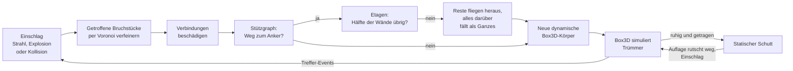

# Nebenan

**Polygonale Echtzeit-Zerstörung für [Box3D](https://github.com/erincatto/box3d), gebaut für Tempo.**
Wände brechen in echte konvexe Polygon-Bruchstücke, nicht in Voxel. Jedes Bruchstück ist eine Box3D-Hülle,
jedes lose Trümmerteil ein Box3D-Starrkörper. Häuser stürzen Etage für Etage ein: Fehlt einer Etage mehr als die
Hälfte ihrer Wände, fliegt der Rest heraus, und alles darüber kommt in einem Stück herunter. Kein Trümmerteil wird
gelöscht. Kein Staub, keine Schatten: Jede Millisekunde geht in die Zerstörung.

- Geschrieben in C17 nach dem Vorbild von Box3D: datenorientiert, Pools mit Generations-IDs, Arena für
  temporäre Daten, keine Abhängigkeiten außer Box3D
- Voronoi-Bruch, der sich auf den Einschlag konzentriert: kleine Splitter am Einschlagpunkt, große Platten
  weiter weg. Nur die getroffenen Bruchstücke werden verfeinert, der Rest der Wand bleibt ein großes Stück
- Voronoi-Zellen und Hüllen laufen auf mehreren Threads, über das Task-System der Anwendung oder eingebaute
  Threads. Das Ergebnis hängt nicht von der Zahl der Threads ab
- Einsturz Etage für Etage, auf jeder Höhe: Hat eine Etage weniger als die Hälfte ihrer Wände, fliegen ihre letzten
  Wände mit Wucht heraus, und alles darüber kommt als ein Stück herunter, gekippt zur Seite, wo die Wände fehlen.
  Die Räume oben bleiben ganz und geben wieder Deckung. Sonst stürzt an einem Haus nichts ein, keine Wand über einem
  Loch und keine Decke, nur was ganz abgetrennt ist, fällt
- Die Wände sind beim Laden in Zellen zerlegt, die auch um die Hausecken laufen, Fenster und Türen sind
  ausgeschnitten. Der Riss unter dem Teil, das herunterkommt, folgt den Zellen und ist überall polygonal
- Für Bauwerke ohne Decken gibt es wahlweise eine Lastprüfung nach dem Lastlöser der Referenz-Engine: Last und
  Schwerpunkt fließen über die Verbindungen zu den Ankern, Verbindungen brechen unter Druck und Biegung
- Kollisionsschaden: Kanonenkugeln und herabfallende Trümmer beschädigen, was sie treffen. Was ein Einsturz
  herunterbringt, beschädigt nichts
- Für ganze Städte gebaut, ohne etwas zu löschen: Trümmer, die zur Ruhe kommen und auf festem Grund liegen,
  werden zu statischem Schutt und kosten Box3D nichts mehr. Box3D bewegt nur eine begrenzte Zahl Trümmer
  gleichzeitig, verdeckte Flächen werden nicht gezeichnet
- Ein Regler für die Bruchstückgröße, der wichtigste Hebel für die Leistung, auch zur Laufzeit
- Deterministisch: gleiche Eingaben ergeben bitgleich das gleiche Bruchmuster, unter Windows, Linux und macOS,
  auf x64 und ARM
- PC-Demo für Windows (Direct3D 11), macOS (Metal) und Linux (OpenGL)

## Demo herunterladen

Jeder Push baut die Demo automatisch mit GitHub Actions.

1. Im Repository oben auf **Actions** klicken, links den Workflow **Build** wählen und den neuesten grünen
   Lauf öffnen.
2. Unten unter **Artifacts** `nebenan-demo-windows` herunterladen (dafür muss man bei GitHub angemeldet
   sein). Für Mac und Linux gibt es `nebenan-demo-macos` und `nebenan-demo-linux`.
3. ZIP entpacken und `nebenan_demo.exe` starten.

Das ist ein Release-Build. Die EXE ist nicht signiert. Wenn Windows SmartScreen warnt: **Weitere
Informationen**, dann **Trotzdem ausführen**. Sie braucht keine Installation und kein
Visual-C++-Redistributable. GitHub löscht Artefakte nach 90 Tagen. Mit **Run workflow** auf der Workflow-Seite
entsteht ein neuer Build.

Unter Linux und macOS gehen beim Entpacken die Ausführungsrechte verloren: `chmod +x nebenan_demo`.
Auf dem Mac zusätzlich `xattr -d com.apple.quarantine nebenan_demo` oder im Finder Rechtsklick,
**Öffnen**. Der Mac-Build läuft auf Apple Silicon.

## Selbst bauen

Voraussetzungen: CMake 3.22 oder neuer und ein C17/C++17-Compiler. Box3D und Dear ImGui liegen als Quellcode im
Ordner [`extern`](extern) bei und werden mitgebaut, der Build braucht also kein Internet.

**Windows** mit Visual Studio 2022 oder neuer (Workload „Desktopentwicklung mit C++"):

```bat
git clone https://github.com/holz231/nebenan.git
cd nebenan
build.bat
build\bin\Release\nebenan_demo.exe
```

`build.bat` in der „Developer Command Prompt" von Visual Studio ausführen, dort ist CMake schon im Pfad. Statt zu
klonen geht auch der ZIP-Download von GitHub: entpacken und im Ordner `build.bat` ausführen.
Danach liegt die Projektmappe `nebenan` im Ordner `build`. In Visual Studio öffnen, oben **Release** statt
Debug wählen, F5 startet die Demo.

**Immer Release zum Messen.** Ein Debug-Build ist 5- bis 20-mal langsamer: ohne Optimierung, ohne Inlining, mit
Laufzeitprüfungen bei jedem Array-Zugriff. Die Demo zeigt einen Debug-Build rot an.

**Linux** (Ubuntu/Debian):

```sh
sudo apt install build-essential cmake git libgl-dev libx11-dev libxi-dev libxcursor-dev
./build.sh
build/bin/nebenan_demo
```

**macOS** mit den Xcode Command Line Tools und CMake (`brew install cmake`):

```sh
./build.sh
build/bin/nebenan_demo
```

CMake-Optionen: `NEBENAN_DEMO`, `NEBENAN_TESTS`, `NEBENAN_BENCHMARK` (bei eigenständigem Bau alle an) und
`NEBENAN_WARNINGS_AS_ERRORS`.

## Steuerung

| Eingabe | Aktion |
| --- | --- |
| Linke Maustaste | schießen, gedrückt halten für Dauerfeuer |
| Rechte Maustaste halten | umsehen |
| W A S D | bewegen |
| Q / E | runter / hoch |
| Shift | schneller bewegen |
| Mausrad | vor und zurück |
| 1 / 2 / 3 | Gewehr / Granate / Kanone |
| R | Szene neu laden |
| P | Pause |
| C | lose Trümmer entfernen |
| V | VSync ein und aus |
| F1 | Menü ein- und ausblenden |

**FPS.** Oben rechts steht immer die echte Bildrate, gemessen über die letzten zwei Sekunden: Bilder pro
Sekunde, die mittlere Bildzeit und das 1 % Low, also die Rate der langsamsten 1 % der Bilder. Daran sieht man
Ruckler. VSync ist aus, die Demo zeichnet so viele Bilder, wie der PC schafft. Mit **V** oder `--vsync` bindet sie
sich an die Bildwiederholrate des Monitors. Unter Windows hält das System eine Flip-Swap-Chain sonst auch ohne VSync
an der Bildwiederholrate fest. Die Demo legt deshalb ihre Swap-Chain mit Tearing-Erlaubnis an, wie Microsoft es für
ungebremste Bildraten vorsieht. Im Fenster zeigt der Compositor trotzdem nur ganze Bilder. Kleben die FPS dennoch an
der Bildwiederholrate, sagt das Menü, woran es liegt. Unter macOS bleibt VSync immer an, dort sagt das Menü, wie
viele FPS die CPU schaffen würde. Die Physik rechnet unabhängig davon 60 Schritte pro Sekunde.

**Leistungsregler im Menü**

- **Bruchstückgröße** (Standard ×2): der wichtigste. Größere Bruchstücke heißen weniger Teile pro Einschlag und
  damit weniger Körper, Kontakte und Dreiecke. ×2 halbiert ungefähr die Zeit bei Massenzerstörung. Gilt für die
  nächsten Einschläge.
- **Bewegte Trümmer** (Standard 1500): wie viele Trümmer Box3D höchstens gleichzeitig bewegt. Weniger macht den
  Physikschritt schneller.
- **Threads**: Die Demo startet mit so vielen Threads, wie die CPU Performance-Kerne hat, höchstens 8. Box3D
  läuft am schnellsten ohne Hyper-Threads und Effizienzkerne.

Daneben stellt **Etage braucht** ein, wie viel ihrer Wände eine Etage zum Stehen braucht (Standard 50 %), und
**Statik ohne Decken** schaltet die Lastprüfung für die Mauern ein (Standard aus).

**Messung.** Das Menü zeigt die Bildzeit und die CPU-Zeit pro Bild, aufgeteilt in Einschläge, Simulation und
Grafik, als Mittel und Spitze der letzten 300 Bilder, dazu Box3D-Schritt, Bruchstücke, Körper, Kontakte,
Dreiecke, Draw Calls und Upload. Es sagt auch, wer die FPS begrenzt: die CPU, die Grafikkarte (ein Bild dauert
deutlich länger, als die CPU dafür braucht) oder VSync. „Messwerte kopieren“ legt alles mit CPU, Grafikkarte und Auflösung in die
Zwischenablage, zum Einfügen in einen Chat.

**Werkzeuge**

- **Gewehr**: kleiner Krater mit Radius 0,35 m. Splitter platzen an der Oberfläche heraus, bei Dauerfeuer
  entsteht ein Loch.
- **Granate**: Explosion mit Radius 1,3 m, reißt große Löcher und schleudert Bruchstücke radial weg.
- **Kanone**: eine echte Box3D-Kugel mit 45 m/s. Der Schaden entsteht allein aus der Aufprallenergie, die
  Kugel schlägt durch und nimmt Trümmer mit.

**Szenen**

- **Mauern**: Ziegelwände vor einer dicken Betonwand
- **Stresstest**: 16 Wände für viele Trümmer gleichzeitig
- **Stadt**: 20 Häuser aus verputzten Ziegelwänden mit Fenstern und Türen und Betondecken, jedes dritte mit drei
  Stockwerken. Die Wände laufen durch alle Stockwerke und sind in Zellen von etwa 1,2 m zerlegt, die auch um die
  Hausecken laufen, die Decken bleiben ganz

**Aufrufoptionen**: `--scene 0..2` startet eine Szene, `--fragment-scale 3` setzt die Bruchstückgröße, `--vsync`
schaltet VSync ein, `--msaa 4` schaltet Kantenglättung ein (Standard aus), `--highdpi` rendert auf
hochauflösenden Bildschirmen in voller Auflösung (Standard aus, kostet Füllrate). `--script` feuert eine
vorgegebene Schussfolge ab, `--frames N` beendet nach N Bildern und meldet CPU-Zeiten, Uploads und Dreiecke pro
Bild, `--screenshot datei.ppm` speichert das letzte Bild (nur OpenGL).

Hinkt die Physik hinterher, lässt die Demo die Zeit langsamer laufen, statt Schritte nachzuholen: Ein zweiter
Schritt im selben Bild kommt nur, wenn ein Schritt weniger als 4 ms kostet. Sonst würde jedes langsame Bild das
nächste noch langsamer machen.

## So funktioniert es


```mermaid
flowchart LR
    A[Einschlag<br/>Strahl, Explosion<br/>oder Kollision] --> B[Getroffene Bruchstücke<br/>per Voronoi verfeinern]
    B --> C[Verbindungen<br/>beschädigen]
    C --> D[Stützgraph:<br/>Weg zum Anker?]
    D -->|ja| S[Etagen:<br/>Hälfte der Wände übrig?]
    S -->|nein| F[Reste fliegen heraus,<br/>alles darüber<br/>fällt als Ganzes]
    F --> E
    D -->|nein| E[Neue dynamische<br/>Box3D-Körper]
    E --> G[Box3D simuliert<br/>Trümmer]
    G -->|Treffer-Events| A
    G -->|ruhig und getragen| H[Statischer Schutt]
    H -->|Auflage rutscht weg,<br/>Einschlag| G
```

**Konvexe Polyeder statt Voxel.** Jedes Bruchstück ist ein konvexes Polyeder aus Ecken und Flächen mit
Ebenen. Schneidet man es mit einer Ebene, entstehen zwei konvexe Polyeder mit exaktem Volumen. Die
Schnittflächen bekommen das Innenmaterial (zum Beispiel Ziegelbruch oder Beton), die Außenflächen behalten
ihr Material. Die gleichen Polygone dienen als Kollisionsform und als Render-Mesh.

**Voronoi-Bruch mit Fokus.** Die Bruchpunkte werden um den Einschlag herum verteilt, mit einer Dichte, die
mit der Entfernung abnimmt. Dadurch entstehen am Einschlag Splitter in der Größe `fragmentSize` und weiter
außen große Platten. Ein Hash-Gitter hält die Punkte auf Abstand. Jede Voronoi-Zelle entsteht durch
Schneiden des Bruchstücks an den Mittelebenen zu den nächsten Nachbarpunkten, sortiert nach Abstand. Sobald
der nächste Punkt weiter als der doppelte Zellradius entfernt ist, kann keine weitere Ebene die Zelle mehr
schneiden, und die Suche endet. Die Zahl der Splitter richtet sich nach dem beschädigten Volumen und ist pro
Einschlag begrenzt.

**Hierarchische Verfeinerung.** Nur Bruchstücke, die die Schadenskugel berühren, werden zerteilt, und jedes
nur bis zur Tiefe `maxDepth`. Eine Wand mit einem Einschussloch besteht danach aus ein paar Dutzend Stücken
statt aus Tausenden.

**Mehrere Threads.** Ein Einschlag läuft in drei Phasen. Zuerst werden die Bruchpunkte aller getroffenen
Stücke in fester Reihenfolge gezogen. Dann berechnen die Worker die Voronoi-Zellen samt Box3D-Hüllen. Jede
Zelle hängt nur von ihren Eingaben ab, die Worker holen sich die nächste Zelle über einen atomaren Zähler und
schreiben in eine eigene Arena. Zuletzt werden Stücke und Verbindungen wieder in fester Reihenfolge
eingebaut. Deshalb ist das Ergebnis mit einem, vier oder acht Threads bitgleich. Wie Box3D nimmt Nebenan das
Task-System der Anwendung (`enqueueTask` und `finishTask` mit denselben Signaturen wie in Box3D) oder
startet eigene Threads. Die Vorzerlegung beim Laden läuft genauso.

**Stützgraph.** Zwei Bruchstücke sind verbunden, wenn sich ihre Flächen berühren. Jede Verbindung hält
`strength × Kontaktfläche` aus, zwischen zwei Materialien mit dem kleineren `strength`. Der Schaden eines
Einschlags fällt zum Rand hin ab. Reißen Verbindungen, sucht Nebenan ab der beschädigten Stelle nach dem
kürzesten Weg zu einem verankerten Stück (Best-First-Suche, dadurch nur lokale Arbeit). Teile ohne Weg zum
Anker werden zu dynamischen Körpern.

**Einsturz.** Häuser stürzen Etage für Etage ein, und sonst stürzt an ihnen nichts ein: keine Wand über einem Loch,
keine Decke, kein Pfeiler unter Last. Nur was ganz vom Boden abgeschnitten ist, fällt.

Beim Laden sucht Nebenan die Decken eines Hauses, die flachen Teile: höchstens ein Viertel so hoch entlang der lokalen
Y-Achse wie breit in beiden anderen Richtungen. Decken, die sich in der Höhe überschneiden, bilden eine Ebene. Eine
Etage ist der Raum unter einer Ebene, von der Ebene darunter oder dem Fuß des Hauses an, und merkt sich das Volumen
der Bruchstücke, deren Mitte in ihr liegt. Ändert sich ein Haus, prüft das nächste Update seine Etagen. Hat eine
Etage weniger als `storeySupport` davon übrig, Standard die Hälfte, gibt sie nach, auf jeder Höhe:

- Ihre letzten Wände fliegen mit 6 m/s aus dem Haus, jedes Stück durch die Seite, an der es frei liegt, bei zwei
  freien Seiten weg von der Mitte des Hauses. Die Teile einer Zelle fliegen zusammen.
- Alles darüber kommt als ein Stück herunter und bleibt ganz, die Räume oben geben danach wieder Deckung. Eine Zelle
  gehört dorthin, wo ihre Mitte liegt, so folgt der Riss den Zellgrenzen und ist polygonal, auch an den Ecken.
- Es kippt zur Seite, wo die Wände fehlen: Es dreht sich um die Mitte der Wände, die übrig waren, umso schneller, je
  weiter sein Schwerpunkt daneben liegt, bis 1 rad/s. Stehen die Reste ringsum gleich, fällt es gerade herunter.
- Die Etagen darunter bleiben stehen und tragen, was herunterkam. Gibt später eine von ihnen nach, kommt sie mit
  allem darauf herunter.
- Schneiden Einschläge das Haus über einer Etage ganz ab, bevor sie unter die Hälfte fällt, kommt der Teil darüber
  genauso herunter, und die Reste der Etage fliegen unter ihm heraus.

Was ein Einsturz herunterbringt, bricht nicht und beschädigt nichts, worauf es landet. Kollisionsschaden wäre das
Teuerste an einem Einsturz. Die Prüfung ist ein Durchlauf über die Bruchstücke eines Hauses und läuft nur, wenn es
sich geändert hat. Ein paar Granaten an einer Ecke bringen ein Haus der Demo nicht herunter, ein Ring um eine Etage
schon.

**Lastprüfung ohne Decken.** Für Bauwerke ohne Decken, etwa eine einzelne Mauer oder einen Klotz auf einer Wand, gibt
es wahlweise die Lastprüfung nach dem Lastlöser der Referenz-Engine (`src/structure/structural_loads.cpp` auf dem
Branch `Referenz`). Sie ist aus, `supportScale` 0, und Häuser prüft sie nie. Eingeschaltet prüft das nächste Update
ein Bauwerk ganz, wenn es sich ändert:

1. Eine Kürzeste-Wege-Suche von den verankerten Bruchstücken aus legt fest, wer wen trägt. Auf etwas Tieferem
   aufliegen ist billig, seitlich tragen kostet die Entfernung, beschädigte Verbindungen kosten mehr. Kleine
   Kontaktflächen kosten extra, und die Last einer Wand wölbt sich um ein Loch herum, statt dessen Splitter einzeln zu
   zerdrücken.
2. Die Last fließt von den entferntesten Bruchstücken nach innen, zusammen mit ihrem Schwerpunkt, verteilt nach
   Fläche, viermal so viel über Flächen, auf denen ein Stück aufliegt. Was die Auflage nicht umgreift, etwa ein
   Überhang, biegt die Verbindungen.
3. Eine Verbindung versagt, wenn Kraft durch Tragfähigkeit plus Biegung durch Biegetragfähigkeit über 1 steigt. Die
   Kraft trägt sie mit `strength` pro m², auf Druck ganz, seitlich zur Hälfte, die Biegung über das Widerstandsmoment
   ihrer Kontaktfläche. Beschädigte Verbindungen tragen im Verhältnis ihrer Restfestigkeit.
4. Alle überlasteten Verbindungen reißen zugleich. Was dadurch den Weg zum Anker verliert, fällt als ein Stück.
   Versagt eine unbeschädigte Verbindung unter dem Gewicht darauf, wird das kleinere ihrer beiden Stücke in sechs
   Splitter zerdrückt, die mit 4 m/s quer aus der Wand fliegen.

Die unbeschädigten Zellen eines vorzerlegten Teils tragen dabei zusammen als ein Block, wie das Teil vor der
Zerlegung. Gibt ein Block nach, kommt er mit allem, was an ihm hängt, in einem Stück herunter. Er reißt unter dem
untersten heilen Teil eines anderen Materials ab, das an ihm hängt, etwa einem Betonklotz, sonst über seinem Fuß, und
die Zellen darunter fliegen mit 6 m/s heraus.

**Trümmer und Schutt.** Ruhe und Einschlafen folgen ebenfalls der Referenz-Engine (`rubble_rest.h` und
`BuildingScene::settle`). Nichts wird gelöscht.

- Ein Trümmer ist ruhig, wenn er 0,2 s lang höchstens 2 cm von einer Lage abweicht, die Drehung als Weg seiner
  entferntesten Ecke gerechnet, und dabei höchstens viermal `debrisSleepThreshold` schnell ist. Oder wenn ihn der
  Löser auf der Stelle schaukelt, sein mittlerer Ort über Halbsekunden-Fenster aber dreimal in Folge auf 3 mm stehen
  bleibt.
- Zu statischem Schutt wird er nur, wenn er auf dem Boden, einem Bauwerk oder Schutt liegt, oder auf einem ruhigen
  Trümmer, der selbst so liegt. Haufen erstarren von unten nach oben, und nichts erstarrt auf etwas, das sich noch
  bewegt. Box3D schläfert nur ganze Inseln ein, diese Kette arbeitet pro Stück. Jedes Stück merkt sich, auf welchen
  Bruchstücken es erstarrt ist und an welcher Stelle.
- Schutt trägt nur, was nicht selbst ihn trägt. Solange ein Stockwerk zum Haus gehört, erstarrt Schutt auf seiner Decke
  und zwischen seinen Wänden. Bricht es ab und sackt ein paar Zentimeter, fängt dieser Schutt es auf, und beide halten
  sich gegenseitig in der Luft. Bevor ein großes Teil ab 0,1 m³ erstarrt, folgt Nebenan deshalb für jedes Stück Schutt,
  das es berührt, den gemerkten Auflagen bis zum Boden oder zu einem Bauwerk. Führt kein Weg dorthin, sondern nur zum
  Teil selbst, zu Bruchstücken, die zerbrochen oder mehr als 5 cm weggerückt sind, oder zu Schutt, der im Flug
  erstarrt ist, trägt das Stück nicht. Das Teil erstarrt nur, wenn sein Schwerpunkt über dem liegt, was es wirklich
  trägt, oder es dazwischen verkeilt ist. Sonst wacht der Schutt auf, auf den es sich stützt, und das Teil kippt oder
  fällt. Kleine Trümmer unter einem großen Teil tragen es nur, wenn sie selbst ohne das Teil liegen.
- Einschläge wecken den Schutt in ihrer Reichweite, den sie bewegen: Stücke, die der Stoß mit mindestens 1 m/s
  anschieben würde. Schwerer Schutt bleibt statisch und verliert nur die Stücke, die der Einschlag herausbricht.
  Sonst käme ein Haus, das ohne Anker auf seinen Stümpfen steht, bei jeder Granate mit Hunderten Kontakten wieder
  zu Leben. Brechen Stücke unterhalb seines Schwerpunkts heraus, kann ihm aber die Auflage fehlen: Dann wacht er
  doch auf und stellt fest, ob er noch getragen wird. Die Referenz weckt jeden getroffenen Körper, dort kostet das
  nichts, in Box3D der Wechsel eines statischen Körpers mit Hunderten Formen bis zu 1 ms.
- Trifft ein Körper, der kein Trümmer ist, Schutt, etwa eine Kugel, wird das getroffene Stück wach, und beide
  teilen sich den Impuls wie bei einem unelastischen Stoß, denn Box3D hat den Körper schon am statischen Schutt
  abprallen lassen. Trümmer, die auf Schutt fallen, lassen ihn in Ruhe: Stücke mitten im Haufen zu wecken gibt jedem
  Dutzende Kontakte und kostete in der Stadt mehr als alles andere.
- Bewegt sich ein Stück 5 cm von dort, wo es lag, wird der Schutt darauf wach, höchstens 32 pro Update: was höher
  liegt als sein Schwerpunkt und was auf ihm erstarrt ist. Teile, die aus einem Bauwerk oder aus Schutt brechen,
  nehmen ihren Schutt genauso mit, nur den Schutt nicht, aus dem sie kommen. So bleibt kein Schutt in der Luft hängen.
- Wacht Schutt auf und bleibt 0,05 s lang langsamer als 5 cm/s, liegt er noch auf und erstarrt gleich wieder, statt
  die ganze Ruhezeit abzuwarten. Was seine Auflage verloren hat, ist nach einem Schritt freiem Fall schon schneller.
- Über `maxDebrisBodies` erstarren die langsamsten Trümmer, die älter als 0,25 s sind, auch im Flug, und merken sich
  ebenso, woran sie liegen. Große Teile erstarren so nur, wenn sie wie oben im Gleichgewicht liegen. Was unter
  `killDepth` fällt, hat die Welt verlassen und wird entfernt. Splitter unter `minFragmentVolume` werden gar nicht erst
  erzeugt.

**Box3D-Anbindung.** Jedes statische Bruchstück hat einen eigenen statischen Körper, denn das Entfernen
einer Form in Box3D kostet so viel, wie der Körper Kontakte hat. Jede lose Insel ist ein dynamischer
Verbundkörper mit einer Hülle pro Bruchstück. Verliert ein Körper mit vielen Kontakten viele Formen auf einmal, wenn
ein herabstürzendes Stockwerk in zwei Teile bricht, nimmt Nebenan ihn dafür kurz aus der Simulation: Das löst seine
Kontakte in einem Zug statt einmal pro Form, und Box3D findet sie im nächsten Schritt wieder. Die Hüllen baut Nebenan direkt aus der bekannten Topologie
des Polyeders, 4- bis 6-mal schneller als Quickhull (`b3CreateHull` bleibt der Fallback). Treffer-Events von
Box3D werden zu Kollisionsschaden: Energie aus reduzierter Masse und Aufprallgeschwindigkeit, Radius aus
der Kubikwurzel der Energie. Weil Box3D den Kontakt schon aufgelöst hat, bevor die Wand bricht, bekommt ein
durchschlagendes Geschoss einen Teil seiner Geschwindigkeit zurück (`collisionPassThrough`).

**Verdeckte Flächen.** In einem Bauwerk liegen die meisten Flächen der Bruchstücke innen, zwischen verklebten
Nachbarn. `nbChunk_GetVisibleFaces` sagt, welche Flächen man sehen kann: Eine Fläche, die die Verbindungen zu
den Nachbarn ganz bedecken, liegt innen. Verliert ein Bruchstück eine Verbindung, meldet es
`nbEvents::exposedChunks`, und der Renderer baut sein Mesh neu. In der zerschossenen Stadt halbiert das die
Dreiecke.

**Determinismus.** Zufallszahlen aus PCG32 mit festem Seed, jede Zufallszahl in einer eigenen Anweisung
(C legt die Reihenfolge innerhalb einer Argumentliste nicht fest, und Compiler machen es verschieden), eigene
Kubikwurzel, keine FMA-Kontraktion und sortierte Abfrageergebnisse. Zusammen mit dem deterministischen Box3D
ergeben die gleichen Einschläge bitgleich die gleichen Bruchstücke, egal ob mit MSVC, GCC oder Clang gebaut,
auf x64 oder ARM, mit einem oder mehreren Threads. Die CI prüft das auf allen Plattformen gegen denselben
Hash.

**Speicher.** Pools mit Freilisten und IDs mit Generationszähler wie in Box3D, sodass veraltete IDs erkannt
werden. Temporäre Daten eines Einschlags kommen aus einer Arena, die danach in einem Schritt zurückgesetzt
wird. Eigene Allokatoren lassen sich mit `nbSetAllocator` einhängen, `nbGetByteCount` zählt den Verbrauch.

**Demo-Renderer.** So wenig Arbeit pro Bild wie möglich:

- Alle Meshes liegen indiziert (16-Bit-Indizes, 20-Byte-Vertices) in Vertex-Seiten mit je 32 768 Vertices.
  Jeder Vertex verweist auf einen Transformations-Slot, alle Transformationen gehen einmal pro Bild in einen
  Storage-Buffer, und der Vertex-Shader holt sie sich selbst. Tausende Trümmer kosten so eine Handvoll Draw
  Calls.
- Eine volle Seite liegt in einem unveränderlichen Puffer im Grafikspeicher. Entfernte Bruchstücke bleiben darin
  liegen, versteckt über ihren freigegebenen Slot, bis ein Drittel der Seite tot ist. Dann ziehen die übrigen
  Meshes in die offene Seite um. Zerstörung kostet so kaum Uploads.
- Flache Beleuchtung im Vertex-Shader, der Pixel-Shader schreibt nur die Farbe. Keine Schatten, keine Texturen,
  keine Partikel, keine Kantenglättung und keine volle Retina-Auflösung, solange man sie nicht einschaltet.

## Benutzung

```c
#include "nebenan/nebenan.h"

// Box3D-Welt wie gewohnt
b3WorldDef physicsDef = b3DefaultWorldDef();
b3WorldId physics = b3CreateWorld( &physicsDef );

// Zerstörungswelt daneben, Voronoi-Zellen auf 4 Threads, doppelt so große Bruchstücke
nbWorldDef worldDef = nbDefaultWorldDef();
worldDef.physicsWorld = physics;
worldDef.workerCount = 4;
worldDef.fragmentScale = 2.0f;
nbWorldId world = nbCreateWorld( &worldDef );

// Ziegelwand: 6 m breit, 3 m hoch, 30 cm dick, unten am Boden verankert
nbDestructibleDef wallDef = nbDefaultDestructibleDef();
wallDef.position = b3ToPos( (b3Vec3){ 0.0f, 1.5f, 0.0f } );
wallDef.material.density = 1900.0f;
wallDef.material.strength = 6.0e5f;
wallDef.material.fragmentSize = 0.1f;
nbCreateBox( world, &wallDef, (b3Vec3){ 3.0f, 1.5f, 0.15f } );

// Schuss: Strahl von der Kamera, Einschlag am ersten getroffenen Bruchstück
nbImpactDef shot = { 0 };
shot.radius = 0.35f;
shot.damage = 1.2e5f;
shot.ejectSpeed = 9.0f;
nbImpactResult result;
nbWorld_CastImpact( world, b3ToPos( eye ), b3MulSV( 100.0f, aim ), &shot, &result );

// Pro Frame
b3World_Step( physics, 1.0f / 60.0f, 4 );
nbWorld_Update( world, 1.0f / 60.0f );

nbEvents events = nbWorld_GetEvents( world );
for ( int i = 0; i < events.createdCount; ++i )
{
	// Neues Bruchstück: konvexes Polyeder im lokalen Raum von nbChunk_GetBody(), dazu welche Flächen
	// man sieht
	nbGeometry geometry = nbChunk_GetGeometry( events.createdChunks[i] );
	bool visible[128];
	nbChunk_GetVisibleFaces( events.createdChunks[i], visible, 128 );
}
// events.destroyedChunks: Meshes entfernen
// events.movedChunks: Bruchstück hängt jetzt an einem anderen Körper
// events.exposedChunks: Mesh neu bauen, verdeckte Flächen können frei geworden sein
```

Gebäude entstehen aus mehreren konvexen Teilen mit `nbCreateDestructible`. Sich berührende Flächen
verschiedener Teile werden automatisch verbunden, `cellSize` zerlegt die Teile schon beim Laden. Ein Teil
kann mit `material` ein eigenes Material bekommen, sonst gilt das des Objekts:

```c
nbPieceDef slab = nbDefaultPieceDef();
slab.halfExtents = (b3Vec3){ 4.5f, 0.125f, 3.25f };
slab.transform.p = (b3Vec3){ 0.0f, 3.125f, 0.0f };
slab.material = &beton;   // Betondecke im Ziegelhaus, def.material ist der Ziegel
```

Bis zu `NB_MAX_MATERIALS` (8) verschiedene Materialien passen in ein Objekt. `nbChunk_GetMaterial` sagt, aus
welchem Material ein Bruchstück ist, und die Box3D-Formen tragen Dichte, Reibung und `userMaterialId` ihres
Materials. Flache Teile wie diese Decke teilen ein Haus in Etagen, siehe Einsturz.

Teile aus demselben Material mit derselben Zellgröße zerlegt Nebenan gemeinsam: Jedes Teil nimmt die Punkte der
anderen bis zwei Zellgrößen jenseits seines Randes mit, so laufen die Zellen über die Stöße zwischen den Teilen
hinweg, etwa um die Ecken eines Hauses, und Risse folgen nicht den Stößen. Die Teile einer Zelle auf beiden Seiten
eines Stoßes fliegen zusammen, damit die gerade Fläche dazwischen nicht zu sehen ist. Ein Teil aus einem anderen
Material, etwa ein Betonklotz auf einer Ziegelwand, behält seine eigenen Zellen.

Fenster und Türen schneidet `openings` aus einem Teil aus, als Quader im Rahmen des Teils. Mit Zellgröße zerlegt
Nebenan das Teil zuerst in Zellen und schneidet die Öffnungen dann aus den Zellen, so laufen die Zellen um die
Öffnungen herum, und Risse folgen nicht deren Kanten. Ohne Zellgröße wird das Teil selbst in konvexe Stücke um die
Öffnungen zerschnitten. `cellSize` am Teil ersetzt die des Objekts, ein negativer Wert lässt das Teil ganz, wie die
Decken der Demo (siehe `AddOpenings` und `AddHouse` in [demo/demo.cpp](demo/demo.cpp)):

```c
// Wand durch zwei Stockwerke mit einem Fenster, in Zellen von etwa 1,2 m zerlegt
nbOpening window = { .center = { -2.0f, -1.5f, 0.0f }, .halfExtents = { 0.8f, 0.65f, 0.3f } };
nbPieceDef wall = nbDefaultPieceDef();
wall.halfExtents = (b3Vec3){ 4.5f, 3.25f, 0.15f };
wall.transform.p = (b3Vec3){ 0.0f, 3.25f, 3.1f };
wall.openings = &window;
wall.openingCount = 1;
wall.cellSize = 1.2f;
```

Die komplette API steht in [include/nebenan/nebenan.h](include/nebenan/nebenan.h).

Einbinden in ein eigenes CMake-Projekt:

```cmake
include(FetchContent)
FetchContent_Declare(nebenan
	GIT_REPOSITORY https://github.com/holz231/nebenan.git
	GIT_TAG <commit>
)
FetchContent_MakeAvailable(nebenan)
target_link_libraries(mein_spiel PRIVATE nebenan::nebenan)
```

Gibt es das Ziel `box3d::box3d` schon, verwendet Nebenan dieses Box3D. Demo, Tests und Benchmark werden
beim Einbinden nicht gebaut.

## Parameter

| Material (`nbMaterial`) | Standard | Wirkung |
| --- | --- | --- |
| `density` | 2400 kg/m³ | Dichte. Beton 2400, Ziegel 1900, Holz 600 |
| `strength` | 1·10⁶ | Schaden pro m² Verbindungsfläche bis zum Bruch, und die Last in N pro m², die eine Verbindung auf Druck trägt (seitlich die Hälfte). Höher ist zäher |
| `fragmentSize` | 0,12 m | Kantenlänge der Splitter am Einschlag |
| `minFragmentVolume` | 2·10⁻⁶ m³ | Kleinere Splitter werden verworfen |
| `maxDepth` | 6 | Wie oft ein Bruchstück weiter zerteilt werden kann |
| `friction`, `restitution` | 0,7 / 0,05 | Reibung und Elastizität der Box3D-Formen |

| Welt (`nbWorldDef`) | Standard | Wirkung |
| --- | --- | --- |
| `fragmentScale` | 1 | Multipliziert die Bruchstückgröße aller Materialien. Der wichtigste Regler für die Leistung: doppelte Größe halbiert die Zeit bei Massenzerstörung. Zur Laufzeit mit `nbWorld_SetFragmentScale` |
| `storeySupport` | 0,5 | Anteil ihrer Wände, den eine Etage zum Stehen braucht. Darunter gibt sie nach, und alles darüber kommt in einem Stück herunter. 0 schaltet es ab. Zur Laufzeit mit `nbWorld_SetStoreySupport` |
| `supportScale` | 0 | Lastprüfung für Bauwerke ohne Decken, Tragfähigkeit der Verbindungen. Kleiner: sie geben früher nach, 0 schaltet sie ab. Häuser prüft sie nie. Zur Laufzeit mit `nbWorld_SetSupportScale` |
| `maxDebrisBodies` | 1500 | Obergrenze für bewegte Trümmerkörper, darüber erstarren die langsamsten zu Schutt. Gelöscht wird nichts. Zur Laufzeit mit `nbWorld_SetDebrisBudget` |
| `enableRubble` | an | Trümmer, die zur Ruhe kommen und auf festem Grund liegen, werden zu statischem Schutt |
| `debrisSleepThreshold` | 0,12 m/s | Viermal so schnell gilt ein Trümmer höchstens als ruhig. Box3D schläfert Inseln ein, die langsamer sind |
| `killDepth` | −100 m | Trümmer darunter haben die Welt verlassen und werden entfernt |
| `collisionSpeedThreshold` | 4 m/s | Ab dieser Aufprallgeschwindigkeit entsteht Schaden |
| `collisionDamageScale` | 12 | Umrechnung von Aufprallenergie (J) in Schaden |
| `collisionRadiusScale` | 0,035 | Schadensradius pro Kubikwurzel der Energie |
| `maxCollisionImpactsPerUpdate` | 4 | Begrenzt die Kollisionseinschläge pro Frame |
| `maxFragmentsPerImpact` | 160 | Begrenzt die Kosten großer Explosionen |
| `collisionPassThrough` | 0,6 | Anteil der Geschwindigkeit, den ein durchschlagendes Geschoss behält |
| `workerCount` | 1 | Threads für Voronoi-Zellen und Hüllen, der aufrufende Thread zählt mit |
| `enqueueTask`, `finishTask`, `userTaskContext` | leer | Task-System der Anwendung, sonst startet Nebenan eigene Threads |

Die Demo nimmt für Ziegel Dichte 1900, Festigkeit 6·10⁵ und Splitter 0,1 m, für Beton Dichte 2400,
Festigkeit 1,1·10⁶ und Splitter 0,13 m, beides mit Bruchstückgröße ×2.

## Leistung

Gemessen mit `nebenan_benchmark` auf einer Cloud-VM mit 4 Kernen (Intel Xeon), GCC 13, Release.
Ein normaler Spiele-PC ist schneller.

**Eine Stadt aus 16 Häusern unter Dauerbeschuss**, zwölf Granaten pro Sekunde, 20 Sekunden lang, pro Frame alles
zusammen (Einschläge, Box3D-Schritt, `nbWorld_Update`), jeweils der mittlere von drei Läufen:

| Stadt | Ø | 95 % der Frames | Box3D-Schritt Ø |
| --- | ---: | ---: | ---: |
| 1 Thread | 21,4 ms | 35,0 ms | 19,0 ms |
| 4 Threads | 9,5 ms | 18,3 ms | 7,4 ms |
| 1 Thread, `fragmentScale` 2 | 5,9 ms | 9,7 ms | 5,3 ms |
| 4 Threads, `fragmentScale` 2 | 3,4 ms | 5,7 ms | 2,8 ms |

Die 240 Granaten verteilen sich auf die Wände beider Etagen aller Häuser, dabei verliert keine Etage die Hälfte ihrer
Wände, und nichts stürzt ein. Ohne Einstürze (`storeySupport` 0) sind es fast dieselben Zeiten: mit 4 Threads 9,5 ms
und mit `fragmentScale` 2 3,2 ms, mit 1 Thread 21,7 und 5,7 ms. `nbWorld_Update` kostet mit 4 Threads im Mittel
1,7 ms, mit doppelter Bruchstückgröße 0,4 ms, und enthält den Schaden durch Aufprall.

Braucht eine Etage 90 % ihrer Wände, stürzen unter demselben Beschuss 17 bis 20 Etagen ein, und die Stadt braucht mit
4 Threads 14,1 ms und mit `fragmentScale` 2 5,7 ms, mit 1 Thread 26,9 und 10,8 ms. Teuer ist, was dann fliegt und
fällt, bis es als Schutt liegt. Die Prüfung der Etagen selbst kostet kaum etwas, und was herunterkommt, bricht nicht
und bricht nichts. Mit der Lastprüfung davor, die jedes Haus unter Last einstürzen ließ, brauchte die Stadt unter
dem Beschuss oben, zur selben Zeit gemessen, 15,3 ms mit 4 Threads und 5,4 ms mit `fragmentScale` 2, mit 1 Thread
29,9 und 10,3 ms.

Die Zeit ist zum größten Teil der Box3D-Schritt, und den bestimmen zwei Zahlen:

- **Bruchstückgröße.** Mit doppelt so großen Bruchstücken liegen am Ende 23 500 statt 81 000 Bruchstücke herum,
  und Box3D rechnet 6600 statt 15 800 Kontakte. Die Zahl der Splitter eines Einschlags fällt mit dem Quadrat
  der Größe.
- **Bewegte Trümmer.** Box3D bewegt höchstens `maxDebrisBodies` (1500) Trümmer gleichzeitig. Was zur Ruhe kommt,
  liegt als Schutt und kostet nichts mehr, am Ende der Stadt 36 400 Körper.

Ganze Einschläge (Bruch, Stützgraph, neue Box3D-Körper) und der Box3D-Schritt danach bei 60 Hz mit
4 Substeps, jeweils mit 1 und 4 Threads, der mittlere von drei Läufen:

| Szenario | Einschlag Ø, 1 / 4 Threads | Box3D-Schritt Ø, 1 / 4 Threads | Am Ende |
| --- | ---: | ---: | --- |
| Gewehr, 200 Treffer | 0,33 / 0,34 ms | 1,1 / 0,9 ms | 3599 Bruchstücke, 919 Körper |
| 20 Explosionen | 3,3 / 2,2 ms | 5,8 / 2,7 ms | 6958 Bruchstücke, 3188 Körper |
| Gebäude, 18 Treffer | 2,5 / 1,7 ms | 3,9 / 1,7 ms | 4830 Bruchstücke, 2393 Körper |

Das Gebäude hat Wände und Decken aus einem Material, und seine Zellen laufen über die Stöße. Jede Zelle über einem
Stoß besteht aus einem Teil auf jeder Seite, so sind es beim Laden 908 statt 549 Bruchstücke.

Voronoi-Kern, Platte 4 × 2 × 0,3 m mit Punkten um den Einschlag, 1 Thread:

| Zellen | Voronoi | Hüllen direkt | Hüllen mit Quickhull |
| ---: | ---: | ---: | ---: |
| 16 | 0,07 ms | 0,02 ms | 0,09 ms |
| 64 | 0,53 ms | 0,11 ms | 0,53 ms |
| 128 | 1,5 ms | 0,25 ms | 1,2 ms |
| 256 | 3,6 ms | 0,54 ms | 2,9 ms |

Grafik der Demo, die ersten acht Sekunden der Stadt im Skript (480 Bilder, Bruchstückgröße ×2): 12 Draw Calls,
höchstens 213 000 Dreiecke, im Mittel 0,5 MB und höchstens 1,7 MB Upload pro Bild, 0,1 ms CPU für Uploads.

**Wenn es trotzdem ruckelt**, der Reihe nach:

1. Release-Build? Debug ist 5- bis 20-mal langsamer.
2. „Messwerte kopieren“ im Menü: Ist Simulation groß, Bruchstückgröße erhöhen (×3 macht die Zerstörung grob, aber
   noch schneller), bewegte Trümmer senken oder „Etage braucht“ senken, dann stürzt weniger ein. Ist Grafik groß
   oder wartet das Bild auf die Grafikkarte, ohne `--msaa` und `--highdpi` starten.
3. Threads auf die Zahl der Performance-Kerne stellen.

## Tests und Benchmark

```sh
build/bin/nebenan_test            # 31 Tests: Geometrie, Voronoi, Hüllen, Öffnungen, Stöße, Stützgraph, Etagen, Lastprüfung, Schutt, Ruhe, Threads, Determinismus …
build/bin/nebenan_benchmark 4     # Zahl = Threads für Bruch und Physik
```

Unter Windows liegen die Programme in `build\bin\Release\`. Die CI baut und testet unter Windows, Linux und
macOS und läuft zusätzlich mit AddressSanitizer, UndefinedBehaviorSanitizer und ThreadSanitizer.

## Projektstruktur

```
include/nebenan/    öffentliche API (C17)
src/
  poly.c            konvexe Polyeder: Schneiden, Masse, Kontaktflächen
  fracture.c        Voronoi-Bruch und Punktverteilung
  hull_builder.c    Box3D-Hüllen direkt aus der Polyeder-Topologie
  world.c           Welt, Bruchstücke, Verbindungen, Stützgraph, Etagen, Lastprüfung, Trümmer, Ruhe und Schutt, Events
  destructible.c    zerstörbare Objekte und Vorzerlegung
  impact.c          Einschläge und Auswurf der Splitter
  scheduler.c       eingebaute Threads, wenn die Anwendung kein Task-System mitbringt
test/               Tests
benchmark/          Leistungsmessung
demo/               PC-Demo mit sokol und Dear ImGui
  shaders/          GLSL-Quelle und die mit sokol-shdc erzeugten Shader (HLSL, Metal, GLSL)
extern/             Box3D (mit sokol) und Dear ImGui, unverändert, siehe extern/README.md
.github/workflows/  CI für Windows, Linux und macOS
```

Nach Änderungen an `demo/shaders/scene.glsl` die Shader neu erzeugen, im Ordner `demo/shaders`:
`sokol-shdc --input scene.glsl --output generated/scene.glsl.h --slang hlsl5:metal_macos:glsl430`.

## Grenzen

- Der Einsturz ist ein Spielmodell, kein Tragwerksnachweis. Eine Etage gibt nach dem Volumen ihrer Wände nach, nicht
  nach der Last darauf, und Trümmer, die auf einem Haus liegen, zählen nicht mit. Ein Haus ohne flache Decken hat
  keine Etagen und stürzt nie ein, es verliert nur, was ganz abgetrennt ist.
- Ein Objekt sollte ein Haus sein. Die Etagen gelten für das ganze Objekt, und was in einer Etage liegt, die
  nachgibt, fliegt mit heraus, auch ein anderes Bauwerk im selben Objekt.
- Die Reste einer Etage fliegen alle auf einmal heraus. Braucht eine Etage fast alle ihre Wände, `storeySupport` nahe
  1, fliegt beinahe eine ganze Etage heraus, und ihre Zellen können sich unter dem Teil darüber verkeilen, der dann
  auf ihnen liegen bleibt.
- Schutt ist für Box3D statisch. Trümmer, die auf Schutt fallen, wecken ihn nicht, nur Einschläge, die ihn bewegen,
  fremde Körper, eine wegrutschende Auflage und große Teile, die ohne ihn nicht im Gleichgewicht lägen. Kinematische
  Körper stoßen Schutt nicht an, Box3D lässt kinematische und statische Körper nicht kollidieren.
- Kleine Trümmer unter 0,1 m³ erstarren auf jedem Schutt, auch auf solchem, den das Budget im Flug erstarren ließ. Sie
  können also noch in der Luft hängen bleiben, ein großes Teil tragen sie dann aber nicht.
- Einstürze kosten: Was fällt und fliegt, bewegt sich, bis es als Schutt liegt. Braucht jede Etage 90 % ihrer Wände,
  braucht die Stadt unter Dauerbeschuss 1,2- bis 1,9-mal so lange wie ohne Einstürze, siehe Leistung.
- Nur die Voronoi-Zellen und Hüllen laufen parallel. Punktverteilung, Einbau der Stücke und das Anlegen der
  Box3D-Formen bleiben auf dem aufrufenden Thread, bei großen Explosionen ist das der größere Teil.
- Nur konvexe Teile, aus denen sich Quader ausschneiden lassen. Andere konkave Formen müssen als mehrere konvexe
  Teile angegeben werden.
- Render- und Physikgeometrie sind dieselben flachen Polygone.
- Box3D ist noch jung (0.x) und kann seine API ändern. Deshalb liegt ein fester Stand bei.

## Lizenzen

Nebenan steht unter der MIT-Lizenz (SPDX-Kennung in jeder Quelldatei). Verwendet werden:

- [Box3D](https://github.com/erincatto/box3d) von Erin Catto, MIT-Lizenz
- [sokol](https://github.com/floooh/sokol) von Andre Weissflog, zlib-Lizenz (kommt mit Box3D)
- [Dear ImGui](https://github.com/ocornut/imgui) von Omar Cornut, MIT-Lizenz

Die Lizenztexte liegen in `extern` neben dem Quellcode der Bibliotheken und dem Demo-Download im Ordner
`lizenzen` bei.
